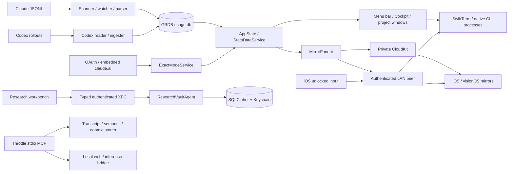

# T1.1 — Codebase map: entry points, boundaries, actual behavior

Author: `codex:F35D9A77` · Task kind: audit · Source snapshot: `32988f4fc99071a95b3684efa9684b57c7d6e810` on `task/T1.1`.

Inspected on 2026-09-22 in `/Users/kevin/GitHub/Throttle/.claude/worktrees/T1.1`. The worktree was clean before this audit; the source was still unchanged at 19:27:45 UTC. This report and its validation receipt are the only task changes. T1.2 implementation, remediation, merging, installation and release work are outside scope.

This is a source-grounded navigation and behavior map, not a full security audit or a release verdict. Runtime descriptions below mean **implemented/wired in this snapshot**, unless a validation is explicitly recorded. Historical test counts, installed-app behavior and documentation are not proof that this checkout builds or ships.

## 1. What this checkout actually does

Throttle is a native Apple coding-agent cockpit with several independently executable surfaces. The Mac app reads Claude Code and Codex usage, manages real CLI terminal processes, offers configuration/context optimizers, exposes local context through MCP, and hosts a research workbench. Optional paths add network-backed usage, AI assistance, CloudKit/LAN mirroring, self-hosted Edge sessions, and remote build/test capabilities. A separately signed Research Vault helper owns encrypted research storage.

There is **no Python application server or Python package** in this checkout. Python supports an isolated Swift test runner, tests of that runner and a shell gate, an Ollama benchmark, marketing image generation, and inline helpers inside Swift/shell/CI files. The self-hosted server and experimental MCP sidecar are **Node.js**, not Python.

Inventory from `git ls-files` (tracked files only, including tests and package manifests):

| Tree | Swift files | Role |
|---|---:|---|
| `Throttle/` | 246 | Mac UI, ingestion, persistence, process control and integrations |
| `ThrottleTests/` | 61 | App-hosted macOS tests |
| `Packages/ResearchVaultKit/` | 76 | Vault libraries, helper runtime, CLI probes and tests |
| `ResearchVaultAgent/` | 1 | Bundled helper entry point |
| `ThrottleShared/` | 24 | Shared contract, peer transport, receipt CLI and tests |
| `ThrottleiOS/` / `ThrottleiOSTests/` | 22 / 1 | iPhone companion and terminal lock tests |
| `ThrottleVision/` | 3 | Spatial mirror |
| `ThrottleWidget/` / `ThrottleiOSWidget/` | 1 / 1 | Widget bundles and iOS Live Activity |
| **Total** | **436** | **80,759 lines; inventory, not test coverage** |

There are also **5 tracked `.py` files, 563 lines**. Section 5 accounts for all five and the inline Python paths.

## 2. Executable surfaces and entry points

[`project.yml`](../project.yml#L1) is the XcodeGen source of truth: eight Xcode targets, Swift language mode 6, complete strict concurrency, macOS 14+, iOS 17+, visionOS 26+. The generated `Throttle.xcodeproj/project.pbxproj` is not tracked. Do not infer a build from its directory being present.

| Surface | Entry point | Activation and responsibility |
|---|---|---|
| Mac application `Throttle` | [`Throttle/main.swift`](../Throttle/main.swift#L1) → [`ThrottleApp`](../Throttle/ThrottleApp.swift#L5) → [`AppDelegate`](../Throttle/AppDelegate.swift#L135) | Dispatches CLI modes before GUI initialization; otherwise starts a SwiftUI MenuBarExtra and AppKit-managed windows/services. `ThrottleApp` deliberately lacks `@main`. |
| Mac widget `ThrottleWidget` | [`ThrottleWidgetBundle`](../ThrottleWidget/ThrottleWidget.swift#L201) | WidgetKit process reads a compact App Group snapshot; does not parse provider transcripts. |
| iOS app `ThrottleiOS` | [`ThrottleiOSApp`](../ThrottleiOS/ThrottleiOSApp.swift#L6) and [`AppDelegate`](../ThrottleiOS/AppDelegate.swift) | CloudKit/LAN mirror, history, alerts and authenticated terminal input to an existing Mac session. Foreground refresh fetches CloudKit state and synchronizes pairing. |
| iOS widget `ThrottleiOSWidget` | [`ThrottleiOSWidgetBundle`](../ThrottleiOSWidget/ThrottleiOSWidget.swift#L266) | Widget + Live Activity/Dynamic Island; App Group snapshot reader. |
| visionOS app `ThrottleVision` | [`ThrottleVisionApp`](../ThrottleVision/ThrottleVisionApp.swift#L8) | Spatial read-only cockpit using shared iOS mirror services. |
| Bundled `ResearchVaultAgent` | [`ResearchVaultAgent/Main.swift`](../ResearchVaultAgent/Main.swift#L3) → [`ResearchVaultServiceRuntime.run`](../Packages/ResearchVaultKit/Sources/ResearchVaultServiceRuntime/ResearchVaultServiceRuntime.swift#L23) | launchd/XPC service owns vault keys and SQLCipher. Embedded with `link: false`; enabled through explicit `SMAppService` registration. |
| `ThrottleTests`, `ThrottleiOSTests` | XCTest/Swift Testing bundles in [`project.yml`](../project.yml#L367) | Hosted by the respective app, not standalone application entry points. |
| Shared SwiftPM CLI | [`ThrottleCFOIngest/main.swift`](../ThrottleShared/Sources/ThrottleCFOIngest/main.swift#L14) | `throttle-cfo-ingest` reads a JSON control-plane receipt on stdin, durably consumes it at `THROTTLE_CFO_JOURNAL`, prints accounting totals. |
| Edge server | [`edge-agent/throttle-agent.mjs`](../edge-agent/throttle-agent.mjs#L1091) | HTTP/MCP control plane for remote sessions, transfers, missions and capabilities; separate Node process on a user-owned host. |
| Experimental refinery MCP | [`experiments/local-context-refinery/mcp-server.mjs`](../experiments/local-context-refinery/mcp-server.mjs) | Separate stdio server for bounded log refinement; deterministic core plus optional Ollama assistance. Repo MCP configs reference a machine-specific external checkout path. |

Other Mac invocation routes are [`AppDelegateDeepLinks.handleDeepLink`](../Throttle/AppDelegateDeepLinks.swift#L17) (`throttle://activate`, `cockpit`, `research-vault[/library]`, `pause`, `resume`, `quiet`, `unquiet`) and [`ThrottleIntents.swift`](../Throttle/Intents/ThrottleIntents.swift) through [`ThrottleCommandChannel`](../Throttle/Services/ThrottleCommandChannel.swift). These can open UI or mutate app/session state; they are not just navigation strings.

### Mac binary CLI dispatch

All of these are branches in [`main.swift`](../Throttle/main.swift#L8), in the same executable as the GUI:

| Flag | Actual destination / effects |
|---|---|
| `--tokopt-hook` | `TokoptHook.run`: stdin PostToolUse payload → eligible Bash-output compression and local savings/raw-output artifacts; MCP responses are measured without rewriting. |
| `--mcp-proxy-selftest <cmd> …` | Starts, initializes, respawns and verifies a downstream MCP child. |
| `--mcp-proxy <port> <cmd> …` | HTTP front end around a stdio MCP child; ordered before `--mcp-server` because child arguments may contain that flag. |
| `--mcp-server` | `ThrottleMCPServer.run`: newline JSON-RPC over stdio; also starts incremental transcript indexing. |
| `--sota-selftest` | Runs `SOTASelfTest` with real local data/model dependencies. Not a hermetic unit test. |
| `--mcp-wrap <cmd> …` | Supervises a downstream stdio MCP process. |
| `--index-repo <path>` | Builds/updates a persistent semantic corpus and manifest for that repository. |
| `--index-search <query>` | Reindexes Claude transcripts, then prints FTS hits. |
| `--web-render-inproc <url>` | Minimal NSApplication/WebKit render probe, with network access to the supplied URL. |
| `--web-bridge-selftest <url>` | Starts the local bridge, temporarily enables the web preference and performs render/cache round trips. |

`-demo` and XCTest-host detection are separate GUI initialization branches in [`AppDelegate`](../Throttle/AppDelegate.swift#L35). They use in-memory databases; they are not evidence of the production ingestion path. Some startup calls precede the launch-time demo/test guards, so these modes should not be described as a general side-effect sandbox.

### ResearchVaultKit CLI products

The complete executable list is declared in [`Package.swift`](../Packages/ResearchVaultKit/Package.swift#L24). These are separate from the Mac binary's flags:

| Product | Source entry under `Packages/ResearchVaultKit/Sources/` | Purpose / boundary |
|---|---|---|
| `research-vault-xpc-service` | [`ResearchVaultXPCServiceMain.swift`](../Packages/ResearchVaultKit/Sources/research-vault-xpc-service/ResearchVaultXPCServiceMain.swift) | Calls the same service runtime as the bundled agent; does not itself establish launchd registration. |
| `research-vault-mcp` | [`ResearchVaultMCPMain.swift`](../Packages/ResearchVaultKit/Sources/research-vault-mcp/ResearchVaultMCPMain.swift#L11) | Direct vault-owning stdio integration harness in Debug. Release prints “direct Release mode disabled” and exits 1. |
| `research-vault-agent-hook` | [`ResearchVaultAgentHookMain.swift`](../Packages/ResearchVaultKit/Sources/research-vault-agent-hook/ResearchVaultAgentHookMain.swift) | Bounded stdin candidate → explicit `--inbox` receipt file/result; not automatic approval of research. |
| `research-vault-catalog-probe` | [`main.swift`](../Packages/ResearchVaultKit/Sources/research-vault-catalog-probe/main.swift) | Inspects/imports a DeepSearsh catalog for a supplied root/project. |
| `research-vault-crash-probe` | [`main.swift`](../Packages/ResearchVaultKit/Sources/research-vault-crash-probe/main.swift) | Database crash/recovery probe; accepts a mode and database path. |
| `research-vault-benchmark` | [`BenchmarkMain.swift`](../Packages/ResearchVaultKit/Sources/research-vault-benchmark/BenchmarkMain.swift) | Catalog/retrieval benchmark against a supplied DeepSearsh root. |
| `research-vault-reasoning-differential` | [`main.swift`](../Packages/ResearchVaultKit/Sources/research-vault-reasoning-differential/main.swift) | Differential logic evaluation harness. |
| `research-vault-reasoning-benchmark` | [`main.swift`](../Packages/ResearchVaultKit/Sources/research-vault-reasoning-benchmark/main.swift) | Reasoning performance harness. |
| `research-vault-synthesis-security-probe` | [`main.swift`](../Packages/ResearchVaultKit/Sources/research-vault-synthesis-security-probe/main.swift) | Synthesis/grounding adversarial probe. |

## 3. Main data and control flows

### Usage and presentation

1. [`DataLayerCoordinator.start`](../Throttle/DataLayer/DataLayerCoordinator.swift#L31) resolves the Claude projects directory, runs `ColdStartScanner`, installs `LiveFileWatcher` and `HourlySweeper`, and signals usage changes. Incremental updates use saved byte offsets and a 500 ms notification debounce. [`SessionFileParser`](../Throttle/Parser/SessionFileParser.swift#L12) consumes complete newline-terminated records; [`UsageExtractor`](../Throttle/Parser/UsageExtractor.swift#L6) extracts assistant-message usage.
2. [`DatabaseManager.databaseURL`](../Throttle/Database/DatabaseManager.swift#L29) points to `~/Library/Application Support/com.lorislab.throttle/usage.db`. [`Migrations`](../Throttle/Database/Migrations.swift) defines usage events, calibration/settings, file cursors, usage snapshots, hook savings, Traycer events, web fetches and Codex usage. These are distinct tables, not one provider transcript store.
3. [`WindowCalculator`](../Throttle/Calibration/WindowCalculator.swift#L12), [`DatabaseQueries`](../Throttle/Database/DatabaseQueries.swift#L10) and [`AppState.refresh`](../Throttle/State/AppState.swift#L189) produce local rolling-window estimates. SQL weights Claude cache reads by one tenth: `input + output + cache_create + cache_read / 10`. This is distinct from raw token totals and from provider-reported cap percentages. `StatsDataService`, `ModelPricing` and `PlanAdvisor` derive reporting/advice; euro values are API-equivalent estimates, not subscription invoices.
4. [`ExactModeService.pollOnceImpl`](../Throttle/Network/ExactModeService.swift#L144) tries `OAuthUsageProvider`, then `EmbeddedClaudeSession`. `AppDelegate` feeds successful exact snapshots into state and calibration. The implemented cadence adapts to pressure/failures. A source comment mentioning Safari at the call site does not change the actual provider path.
5. Codex has two paths: [`AppState.refreshCodexUsage`](../Throttle/State/AppState.swift#L149) reads recent provider-emitted `token_count` state for the live meter (30-second timer in [`AppDelegate`](../Throttle/AppDelegate.swift#L388)); [`CodexUsageIngester`](../Throttle/DataLayer/CodexUsageIngester.swift#L39) polls every 120 seconds and upserts cumulative totals per session. It scans three recent date directories, not an unlimited historical backfill.

### Cockpit, assistant and optimizer behavior

[`MultiCockpitModel.swift`](../Throttle/UI/Cockpit/MultiCockpitModel.swift) contains both per-tab process/session state and the multi-session coordinator. It launches/restores Claude Code and Codex through SwiftTerm/login-shell processes, monitors activity and resource pressure, and supports pause/resume/hibernation. [`MissionRuntimeService`](../Throttle/Services/MissionRuntimeService.swift#L9) distinguishes `claudeCode`, `codex`, `local`, and `terminal`; provider-native session IDs remain separate. [`continueMission`](../Throttle/UI/Cockpit/MultiCockpitModel.swift#L1702) hibernates the source before creating the target with a reviewed handoff prompt. This is a process-control boundary, not merely a usage dashboard.

[`CockpitWindowController`](../Throttle/UI/Cockpit/CockpitWindowController.swift), [`ProjectWindowController`](../Throttle/UI/ProjectWindow/ProjectWindowController.swift) and the research workbench use AppKit window controllers. The single MenuBarExtra scene does not mean the app lacks external windows.

Project assistant routing lives in [`AIProviderRegistry`](../Throttle/Services/AIProviderRegistry.swift): Apple Intelligence, embedded MLX, Claude web session or API key. Selecting the embedded provider fails closed if unavailable. Reviewed patch application, command execution and terminal paste have separate paths (`AssistantTools`, `FileEditor`, `CommandRunnerService`, `BashSandbox`, `ReviewedPasteService`, `ApplyPatchesSheet`). Configuration services such as `TokoptHookInstaller`, `ReadFirewallInstaller`, `TranscriptMemoryInstaller`, `OutputStyleManager` and `StatuslineService` can write agent configuration/hooks. Context trimming and autopilot services can also mutate local artifacts when enabled; this codebase is not globally read-only.

### Context, local inference and research

[`ThrottleMCPServer`](../Throttle/Services/ThrottleMCPServer.swift#L16) uses newline-delimited JSON-RPC. Its source tool catalog includes transcript search, budget/cost/loadout health, content-pointer expansion, durable recall, global portfolio context, semantic search and bounded file reads. Model-backed tools are conditionally advertised; web tools depend on the web preference. `ContextFirewall` selects reversible evidence excerpts, while [`ContentStore`](../Throttle/Services/ContentStore.swift#L14) retains the original bytes by SHA-256 for expansion.

The GUI-less MCP process hands rendering and model work to [`WebRenderClient`](../Throttle/Services/WebRenderClient.swift) / [`WebRenderBridge`](../Throttle/Services/WebRenderBridge.swift#L111): `/render`, `/summarize`, `/delegate`. The app starts the bridge during launch; web rendering itself is preference-gated. [`LocalWorkerRouter`](../Throttle/Services/LocalWorkerRouter.swift#L17) prefers a configured healthy Ollama endpoint and falls back to embedded MLX. “Local worker” therefore can mean a user-configured remote machine; bounded evidence text crosses that boundary. `EmbeddedModelProvider` manages the on-device alternative.

Research ingestion is another subsystem: [`ResearchVaultWorkbenchView`](../Throttle/UI/ResearchVault/ResearchVaultWorkbenchView.swift), `ResearchVaultFolderSourceStore`, `ResearchVaultURLIntake`, and `NotebookLMImportJob` gather selected sources. [`NotebookLMGatewayClient`](../Throttle/Services/NotebookLMGatewayClient.swift#L38) launches a configured `notebooklm-sota` stdio command for notebook/source listing and export; that external gateway's implementation is not in this checkout. Ingestion parsers/chunkers/extractors are client-safe, while import/review/query/export persistence goes through the vault owner/query XPC endpoints. `ResearchVaultSynthesis` and `ResearchVaultSynthesisProvider` produce bounded drafts over evidence; a generated draft is distinct from stored approved evidence.

## 4. Boundaries, stores and dependencies

| Boundary | What crosses it / owner | Source anchors and qualification |
|---|---|---|
| Provider files → Mac DB | Claude JSONL events and recent Codex counters become derived local rows; CLIs retain their native stores/authentication. | `DataLayer/`, `Parser/`, `CodexUsageService`, `MissionRuntimeService`. Parsing counters is not intercepting provider API traffic. |
| Mac UI → research helper | Typed XPC requests/responses; separate query and owner endpoints. Helper holds Keychain-derived keys and SQLCipher store. | [`project.yml`](../project.yml#L159), [`ResearchVaultServiceManager`](../Throttle/Services/ResearchVaultServiceManager.swift#L47), [`service runtime`](../Packages/ResearchVaultKit/Sources/ResearchVaultServiceRuntime/ResearchVaultServiceRuntime.swift#L23), [`ResearchVaultXPC`](../Packages/ResearchVaultKit/Sources/ResearchVaultXPC/ResearchVaultXPC.swift). Runtime policies bind signing identities and project/sensitivity scopes. Not an in-process database abstraction. |
| Helper ↔ other authorized client | Query endpoint also names CheatCode; Throttle has a separate restricted-sensitivity query/owner policy. | [`launchd plist`](../ResearchVaultAgent/com.lorislab.throttle.research-vault-agent.plist), service runtime. This identifies a code-level integration only; no other project or deployed account was inspected. |
| Mac → CloudKit/LAN → companion | `ThrottleMirrorSnapshot`, session summaries and pairing bootstrap. CloudKit publisher uses private DB; LAN transport uses Bonjour + TLS-PSK. | [`MirrorFanout`](../Throttle/State/MirrorFanout.swift), [`CloudKitPublisher`](../Throttle/Network/CloudKitPublisher.swift#L33), [`PeerTransport`](../Throttle/Network/PeerTransport.swift), `ThrottlePeer/`. |
| iPhone input → Mac process | Paired terminal attach/input routes into Mac terminal bridge. Phone starts locked, requests device-owner authentication and relocks on inactivity/background. | [`RemoteTerminalView`](../ThrottleiOS/Views/RemoteTerminalView.swift), [`TerminalLockState`](../ThrottleiOS/Services/TerminalLockState.swift#L12), [`PeerTerminalBridge`](../Throttle/Network/PeerTerminalBridge.swift). Local unlock is a client-side gate, separate from transport authentication. |
| Companion → App Group/widget | Latest snapshot and capped history stripped of secrets. | [`MirrorStore`](../ThrottleiOS/Services/MirrorStore.swift#L55) stores at most 1,500 history entries. Mac widget uses a different compact `ThrottleIntentSnapshotV1` payload. |
| Mac → self-hosted Edge | Bearer-authenticated HTTP/MCP, repo/transcript transfers, remote process lifecycle and ttyd WebSocket attachment. | `RemoteSessionsService`, `EdgeDeployService`, [`EdgeAgentService`](../ThrottleShared/Sources/ThrottleShared/EdgeAgentService.swift), `TtydClient`, [`agent routes`](../edge-agent/throttle-agent.mjs#L1091). Node refuses non-loopback binds; private HTTPS proxy is deployment infrastructure outside the process. `/health` is unauthenticated. |
| Edge queue → Mac capability host | Opt-in polling can run allowlisted Xcode build/test and lint capabilities in a resolved `~/GitHub` repository, returning bounded output. | [`CapabilityHostService`](../Throttle/Services/CapabilityHostService.swift#L31), [`throttle-ask`](../edge-agent/throttle-ask). This is remote-triggered execution, distinct from mirroring. |
| Local integrations → listeners | Traycer OTLP on 4318; web/model bridge on 4319; MCP proxy uses its supplied port. | [`WebRenderBridge`](../Throttle/Services/WebRenderBridge.swift#L59) checks peer addresses for loopback after a port-only listener bind. [`MCPProxyServer`](../Throttle/Services/MCPProxyServer.swift#L29) sets a loopback local endpoint. [`TraycerReceiver`](../Throttle/Services/TraycerReceiver.swift#L45) is opt-in but uses a port-only listener and has no equivalent address check in this source; its loopback comment is not proof of enforcement. Network reachability was not tested. |
| App → external services | Exact usage, enabled network AI, selected web pages, optional NotebookLM gateway, model downloads, licensing and updates. | `OAuthUsageProvider`, `EmbeddedClaudeSession`, `ClaudeAPIKeyProvider`, `WebRenderer`, `NotebookLMGatewayClient`, `EmbeddedModelProvider`, [`LicenseService`](../Throttle/Network/LicenseService.swift#L26), `UpdaterService`. Local-first does not imply offline-only. No production requests were tested. |

Important persistence locations in source:

| Location | Owner / content |
|---|---|
| `~/.claude/projects`, `~/.codex/sessions` | Native provider sessions; source of usage and session discovery. |
| `~/Library/Application Support/com.lorislab.throttle/usage.db` | GRDB application database, migrated by `Migrations`. |
| `~/Library/Application Support/Throttle/transcript-index.db` | [`TranscriptIndex`](../Throttle/Services/TranscriptIndex.swift#L24), FTS transcript search. |
| `~/Library/Application Support/Throttle/semindex/` | [`SemanticCorpusStore`](../Throttle/Services/SemanticCorpusStore.swift#L10), per-repo index/manifest JSON. |
| `~/Library/Application Support/Throttle/cmv-store/` | `ContentStore`, hash-addressed archived payloads. |
| `~/Library/Application Support/Throttle/GlobalRAG/` | [`GlobalRAGService`](../Throttle/Services/GlobalRAGService.swift#L86), profile and derived portfolio snapshot. |
| `~/Library/Application Support/Throttle/ResearchVault/vault.ccsql` | Helper-owned SQLCipher database; key material from Keychain. |
| `~/.claude/settings.json`, `~/.claude.json`, hook/style/statusline files | Explicit installers/configuration tools; startup reconciliation may heal already-installed paths. |
| App Group `group.com.lorislab.throttle` | Widget snapshots, companion history and command/snapshot integration. |

The Mac app is not App Sandbox-enabled in [`Throttle.entitlements`](../Throttle/Throttle.entitlements); Release hardened runtime is enabled in `project.yml`. Thus helper, file-selection, process and network boundaries matter even though much of the code is in one Mac target.

Dependency ownership is explicit in the manifests. Mac links GRDB 6.29.3, Sparkle 2.9.1, SwiftTerm 1.14.0, MLXSwiftLM 3.31.3, HuggingFace 0.9.0, SwiftTransformers 1.3.0, local `ThrottleShared`/`ThrottlePeer`, and client-safe vault products. `ResearchVaultKit` pins SQLCipher.swift 4.18.0. Its Model/IPCModel/XPCClient/Synthesis/Ingestion products sit on the client side; Gateway/SQLCipher/Keychain/ServiceRuntime and XPC listeners sit on the owner side. `ResearchVaultReasoning` implements logic/projection; Store supplies storage/key-derivation abstractions. [`verify-research-vault-dependencies.sh`](../scripts/verify-research-vault-dependencies.sh) checks the dependency closure; [`verify-research-vault-bundle.sh`](../scripts/verify-research-vault-bundle.sh) checks actual bundle separation. Neither gate was run for a release artifact here.

## 5. Python inventory, including inline Python

| File / entry | Inputs → outputs | Runtime dependencies and side effects |
|---|---|---|
| [`scripts/verify-core-evidence.py`](../scripts/verify-core-evidence.py#L92), `main()` | Exact selected production Swift files/tests → temporary SwiftPM package, test logs, xUnit XML, hashed `receipt.json`. | Python stdlib + installed Swift toolchain. Executes XCTest and Swift Testing separately; rejects missing/failed/duplicate cases and source changes. It covers a bounded validator subset, not the GUI or SQLCipher. |
| [`scripts/tests/test_core_evidence.py`](../scripts/tests/test_core_evidence.py#L12) | Synthetic XML reports → six unittest cases. | Tests completed-case validation, including missing/duplicate/skipped/failing reports. Uses temporary files. |
| [`scripts/tests/test_no_match.py`](../scripts/tests/test_no_match.py#L9) | Temporary fixtures / bad arguments → three unittest cases. | Executes `assert-no-match.sh`; confirms absence succeeds and match/tool/input failures fail without echoing fixture content. |
| [`experiments/local-delegation-bench/bench.py`](../experiments/local-delegation-bench/bench.py#L149), `main()` | `cases.json`, current/baseline prompts, `--url`, model and run count → printed fact/quote/JSON/confidence scores and exit status. | Python stdlib HTTP POST to Ollama `/api/generate`. Default endpoint is a hard-coded tailnet address, not loopback; pass an explicit endpoint before use. Sends case text to that endpoint. Not run here. |
| [`design/appstore/make-screenshots.py`](../design/appstore/make-screenshots.py#L1), module-level calls | Hard-coded sample values/drawing functions → three 1320×2868 PNGs. | Pillow and macOS fonts; creates/writes a hard-coded path in a different username's checkout. These are drawn marketing compositions, not runtime screenshots. Importing the module executes generation. Parsed only, not imported/run. |

Python is also embedded in these paths, so a `.py`-only search is incomplete:

- [`StatuslineService.swift:35`](../Throttle/Services/StatuslineService.swift#L35) emits a shell script containing `/usr/bin/python3 -c`. If the prerendered status line is older than 150 seconds, Python parses Claude's stdin `rate_limits` and prints percentages. This is a real optional user-facing runtime dependency.
- [`edge-agent/throttle-ask:104`](../edge-agent/throttle-ask#L104) parses a completed capability result, prints output and propagates its exit code after shell-driven remote requests.
- [`scripts/throttle-sync.sh:321`](../scripts/throttle-sync.sh#L321) contains a reconciliation helper that rewrites selected conflict hunks and writes `.throttle-decisions.md`. It is mutating automation, not a read-only inspector; not executed for this audit.
- [`scripts/probe-claudeai.sh:102`](../scripts/probe-claudeai.sh#L102) parses organization JSON inside a credentialed network diagnostic; not run here.
- [`.github/workflows/ci.yml:38`](../.github/workflows/ci.yml#L38) prints generated verification receipts with inline Python. CI also invokes the two Python test modules and the isolated Swift runner.

## 6. Build inclusion, legacy material and proof limits

These distinctions prevent navigation mistakes:

- **Retained iOS source is not all shipped source.** [`project.yml:246`](../project.yml#L246) excludes `EdgeSessionsService.swift`, `EdgeSessionListView.swift` and `EdgeTerminalView.swift` from the iOS target; visionOS also excludes the Edge service. [`AppState+Mirror`](../Throttle/State/AppState+Mirror.swift#L62) sets Edge host/port/token and peer fallback host to nil. Off-LAN Edge capability belongs to the Mac/direct-distribution path in this target graph.
- **Safari code is not the current Exact-mode path.** `SafariBridge.swift` remains in the source tree, but current exact polling invokes OAuth and the embedded session. The repository skill's Safari/AppleScript description, old database path and single-terminal/no-cloud doctrine are stale orientation material; `project.yml`, call sites and current source take precedence.
- **The research stdio executable is not the production vault boundary.** Release access is through the authenticated XPC owner/query service, not `research-vault-mcp`.
- **The assigned plan interface is not implemented in this source catalog.** `ThrottleMCPServer.tools/list` contains no `throttle_task_event`. The installed app advertises additional plan bootstrap/explore tools, but also no task-event tool. Installed binary and checkout have different catalogs; neither proves the other's revision. The dated plan-store design is not evidence of shipped code.
- **Old ledgers and screenshots are not this snapshot's evidence.** `docs/TODO.md` cites other commits/checkouts and historical test/release results. The screenshot Python draws sample values. Neither was used to claim runtime readiness here.

## 7. Verification performed and routes for further validation

Environment observed: macOS 27.0, Xcode 27.0 build 27A266a, Apple Swift 6.4, arm64. No GUI app was built, installed or launched for this source audit. The installed Throttle binary was invoked only in stdio MCP mode to inspect its tool catalog; that mode's source also starts incremental transcript indexing.

| Check | Result | Evidence / scope |
|---|---|---|
| Tracked-source inventory and Python AST parsing | PASS | 436 Swift files, 5 Python files; all 5 Python files parsed without executing their top-level code. |
| Report references and receipt freshness | PASS | Every relative file/line link resolves; all 14 receipt source hashes match this checkout. |
| `python3 -B -m unittest discover -s scripts/tests -p 'test_*.py' -v` | PASS | **9 tests**, 0 failures. Six receipt-validator tests plus three shell-gate tests. |
| `python3 -B scripts/verify-core-evidence.py --output-parent /private/tmp/throttle-t1.1-evidence` | PASS after infrastructure retry | **39 distinct cases**, 0 errors; [committed receipt](T1.1-core-evidence.json). First run was blocked by compiler-cache permissions before tests; approved retry passed. |
| Swift subset scope | BOUNDED | `TestOutcomeDetectorTests`, `TestOutcomeStoreTests`, `ContextPacketEvidenceTests`, `RetrievalBenchmarkTests`, `RetrievalQualityGateTests`; exact sources copied by the existing runner. |
| Full macOS/iOS/visionOS builds and tests; full Shared/Vault package suites; Node tests | NOT RUN | Not needed to establish this documentation map. No broad build, runtime, signing, device, production or security-readiness claim follows from the subset. |

The successful run's full transient artifacts are at `/private/tmp/throttle-t1.1-evidence/throttle-core-evidence-k20jpi2t/` (`output.log`, `xctest.xml`, `swift-testing.xml`, package and receipt). The failed sandbox run is retained at `/private/tmp/throttle-t1.1-evidence/throttle-core-evidence-zllgotbv/`. The committed receipt records source, manifest, runner, log and report hashes; temporary logs may not survive cleanup.

The repository's broader validation entry points are [`README.md`](../README.md#L55), [`.github/workflows/ci.yml`](../.github/workflows/ci.yml), [`ThrottleShared/Package.swift`](../ThrottleShared/Package.swift), [`ResearchVaultKit/Package.swift`](../Packages/ResearchVaultKit/Package.swift), the two Node `package.json` files and the vault dependency/bundle scripts. `scripts/build-dmg.sh`, `finalize-dmg.sh`, `smoke-test.sh` and `.github/workflows/testflight.yml` own packaging/distribution gates; discovering them does not authorize running a release.

## 8. Task reporting and handoff

Reporting identity: `by = "codex:F35D9A77"` throughout. Progress was reported in the conversation at 20%, 40%, 65% and 85%, with file inventory and test-count evidence.

**Task-event delivery is blocked:** no `throttle_task_event` callable was exposed in this session. A read-only `tools/list` request to `/Applications/Throttle.app/Contents/MacOS/Throttle --mcp-server` confirmed the installed server also omits it. No task-event schema was guessed and no plan/event-store files were edited directly. This report records the limitation; it is not an assertion that Throttle accepted progress, evidence or completion events.

Acceptance for T1.1 is a committed, source-linked map of all executable families, the major data/control and storage boundaries, every tracked Python entry point, inline Python dependencies, source-inclusion exceptions and explicit validation limits. Verification should inspect this report and its receipt at the task commit; T1.2 remains untouched.
