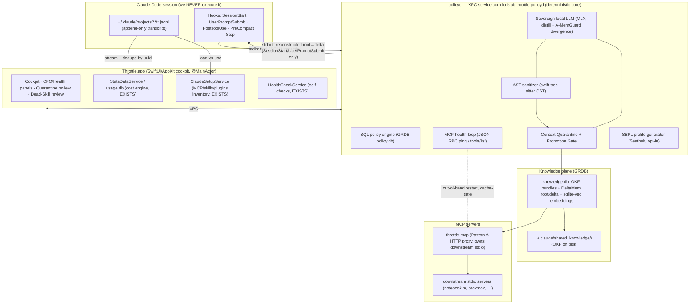

# Throttle v3.0 — Unified Implementation Blueprint

Principal-architect synthesis of three verified research reports (polyrepo
context routing · async-MCP/dead-skill · LLM-agent security) into one Swift 6 /
XPC design. Grounded in the existing codebase: the four pillars map almost 1:1
onto services Throttle already ships.

**Sources (verified, cite by full ID):** DeltaMem residual trees arXiv:2606.03083
(github.com/import-myself/DeltaMem) · CMV arXiv:2602.22402 (claude-code-cmv) ·
Reliable Graph-RAG arXiv:2601.08773 (AST > LLM extraction) · A-MemGuard
arXiv:2510.02373 · CodeSentinel arXiv:2606.19235 · RAG-MCP arXiv:2505.03275 ·
"Less is More" arXiv:2411.15399 · Google OKF v0.1 · MCP `ping` spec · bx-mac
Seatbelt. Traps to avoid: δ-mem arXiv:2605.12357 (different paper), Kompress/
SmartCrusher (unverifiable) — do NOT build on these.

---

## 0. Architect's verdict up front (read this first)

| Pillar | Doctrine fit | Verdict |
|---|---|---|
| **1. AST interception + Context Quarantine** | observes/sanitizes untrusted DATA (not intent) | **GO, opt-in, fail-open** |
| **1b. Seatbelt sandbox of the agent** | confines fs, doesn't execute agent | **GO behind a profile + allowlist** (dependency-starvation risk) |
| **2. Async MCP remediation + Dead-Skill audit** | pure librarian/CFO | **GO — highest ROI, lowest risk, ship first** |
| **3. Bifurcated routing (FORCE gen→Haiku)** | **violates "never alter intent"** + Kevin runs Opus deliberately | **RESHAPE → measure & NUDGE, never force** |
| **4. Polyrepo OKF/DeltaMem cross-repo** | librarian; but auto-moves A→B context | **GO staged, quarantine is a launch gate** |

The single biggest correction: **pillar 3 as written (a gateway that forces
generation onto Haiku) is off-doctrine.** Throttle never alters human intent.
Reshape it as a *cost-per-outcome meter + a one-click switch nudge* — the agent's
model choice stays the user's. Everything else is buildable and largely already
scaffolded.

---

## 1. Global architecture



**Why XPC `policyd`:** privilege separation (the App is a notarized GUI; the
deterministic policy/sanitize/sandbox core is a separate audited XPC peer with no
network entitlement). Swift 6: `policyd` exposes a `@Sendable` actor-isolated
protocol over `NSXPCConnection`; the App holds a `PolicyClient` actor. All hook
binaries are the SAME Throttle Mach-O invoked with a flag (the existing
`--tokopt-hook` pattern), so there is no separate helper to ship/sign.

---

## 2. Pillar-by-pillar Swift 6 integration

### Pillar 2 first — MCP remediation + Dead-Skill audit (ship Stage 1)

*Lowest risk, highest ROI, and ~70% already built.*

**Dead-Skill audit** reuses `ClaudeSetupService` (already reads `~/.claude.json`
mcpServers + skills + plugins) for the *loadout*, and a `WorkActivityService`-style
jsonl pass for *usage*:
```swift
// GRDB: one row per (tool, day). Dedupe tool_use by message.uuid (CC rewrites on branch).
struct ToolUse: Codable, FetchableRecord, PersistableRecord {
  var name: String        // mcp__<server>__<tool> | Skill name
  var server: String?; var day: Int64; var count: Int
}
// Dead = loaded ∧ uses==0 over trailing 30d (== transcript cleanupPeriodDays).
// Rank remediation by cost × (1 − use_freq); cost = count_tokens(tools/list JSON)
// for the TARGET model (never tiktoken — undercounts Claude tokens).
```
Ground-truth booster: set `OTEL_LOG_TOOL_DETAILS=1` → CC emits `skill_activated`
events; ingest those instead of inferring. Surface as a **CFO panel** (extends the
existing Health/Activity panels): "Dead skills cost you N tokens/session," per-server
cost, last-used. **Recommendation + evidence, never auto-purge** (a tool unused 30d
may save next week). Acting = explicit per-item toggle; relocate heavy skills into
nested `.claude/skills/` (reversible move, verify via re-reading `/context`); prefer
**Tool Search deferral** (`ENABLE_TOOL_SEARCH`) over hard unload (≈85% of the token
win, zero capability risk, cache-safe because deferred defs sit *after* the cache
breakpoint).

**Async MCP remediation** extends `HealthCheckService`. `policyd` runs an
out-of-band JSON-RPC loop per managed server: `ping` every 15–30s (3–5s timeout),
periodic `tools/list` for schema-drift hashing, plus `ps` liveness (CPU-spin #36729,
RSS bloat). **Pattern A proxy** (`throttle-mcp`) is the strong form: register ONE
Throttle HTTP MCP server (`claude mcp add --transport http throttle …`); it owns the
real stdio servers as children and multiplexes their tools upward. On a failed probe:
SIGTERM→SIGKILL the child + reap orphans by command signature, optional opt-in SQLite
vacuum, re-`initialize` — **all invisible to Claude Code, prompt cache fully
preserved** (the parent's HTTP session to Throttle never changes). Re-announce a
byte-identical upward `tools/list` so even non-Tool-Search models (Haiku/Vertex) keep
the cache. MTTR: 60–120s + cache-rebuild → sub-second, zero cache penalty.

### Pillar 1 — AST interception + Context Quarantine

Extends the **existing `--tokopt-hook` PostToolUse** path. Tool result JSON →
`policyd` over XPC. Two jobs on the same tap:

1. **Compress (CCR)** — for low-signal success output, deterministic CMV trim +
   Tree-sitter symbol extraction; emit `hookSpecificOutput.updatedToolOutput` = a
   ~50-tok pointer (see the CCR design doc). **Hard fail-open**: command failed /
   stderr / stack trace / JSON the model needs verbatim → emit nothing, pass the
   FULL original (CC sees unmodified output). PostToolUse runs AFTER execution, so it
   never bypasses CC's permission prompts.
2. **Sanitize (CodeSentinel-style, OPT-IN)** — `swift-tree-sitter` builds the CST;
   inspect comment/string-literal/identifier/decoy nodes. Stage 1 deterministic
   normalize (strip zero-width homoglyphs, score vs jailbreak signatures); Stage 2
   only on weak signal → MLX Qwen-2.5-1.5B under JSON-schema. Malicious node →
   **syntax-preserving perturbation** (replace with same-CST-type benign placeholder,
   re-serialize) so the AST stays valid — never delete lines.

**Context Quarantine** (memory write-path): any candidate fact lands in an
*ephemeral trace buffer*, never directly in `knowledge.db`. The **Promotion Gate**
(deterministic, SQL): classify type, resolve scope tuple (tenant/repo/session),
content-hash + scope dedup (kills MemPoison flooding), mandatory provenance
(source repo, session uuid, tool, timestamp), instruction-strip natural-language
nodes. Code/JSON/stack-trace nodes are structurally safe (typed AST, not free text).
**A-MemGuard divergence** (MLX): score the new memory's reasoning path vs a cohort of
related history; radical deviation → flag, route to an isolated "Lesson Memory" store
(negative-precedent DB the agent can later consult), not silently dropped.

**Seatbelt (opt-in profile):** `policyd` generates SBPL at runtime per active
workspace — default-deny `file-read-data`, allowlist cwd + a heuristic global set
(`~/.npmrc ~/.cargo ~/.gradle /usr/local/include …`), deny `~/.ssh ~/.aws` post
symlink-resolution. Launch claude under `sandbox-exec`/bx-mac. **Strictly opt-in** —
the dependency-starvation risk (opaque kernel-MAC failures → phantom syntax errors)
is real; ship with a "sandbox blocked path X — allow?" detector.

### Pillar 3 — Cost-per-outcome meter (NOT a forcing gateway)

**Reshaped to fit doctrine.** Throttle does not route the user's model. It:
- Detects "verify gate" episodes in jsonl (a DeepEval/test-run tool_use cluster
  terminated by pass/fail) and the generation episodes around them.
- Joins to `usage.db` weighted-token cost → **"cost per test passed" in EUR** per
  session/project (new StatsDataService query; the cost engine already exists).
- Surfaces a **nudge**, never an action: "this generation ran on Opus at €X; the
  same shape on Haiku ≈ €Y — switch for boilerplate?" One-click sets the model for
  the *next* prompt only; the agent's choice is never overridden mid-flight.

This keeps the moat (decide/attribute/optimize) without crossing "never alter
intent" — and respects that Kevin runs Opus on purpose. A true auto-router stays a
separately-gated, opt-in-only mode (same posture as the circuit-breaker ACT).

### Pillar 4 — Polyrepo OKF / DeltaMem (staged, quarantine = launch gate)

**Harvest** (`PreCompact` first — auto-compaction fires ~83.5% / ~167K tokens, so
capture before, not after): detect a successful deep-research episode in jsonl
(burst of WebFetch/WebSearch/Read tool pairs over a token threshold, terminated by an
assistant text block with no error). CMV-trim the sub-trace, Tree-sitter-extract
code/JSON, MLX-distill ONLY the natural-language narrative. **Write OKF v0.1** to
`~/.claude/shared_knowledge/<slug>/` (markdown concepts + YAML frontmatter `type/
title/description/resource/tags/timestamp`, `index.md`, cross-links).

**Store** (DeltaMem residual trees): content-addressed root blob (generalized fact,
e.g. "Stripe idempotency keys") + per-project delta blobs (only the variation), SHA-
256 keyed, in `knowledge.db`. GRDB graph tables `Repo/Topic/Bundle/Symbol` + edges;
sqlite-vec (via GRDB) holds one MLX `bge-small` (384-d) embedding per node.
Reconstruction = walk root→leaf chain (DeltaMem composition). Consolidate high-
frequency paths into new roots as an idempotent hook-invoked batch (zero daemon).

**Serve** (`throttle-mcp` Resource + `UserPromptSubmit` `additionalContext`): hybrid
score = BM25/FTS × cosine, reciprocal-rank fused; if top bundle clears a HIGH
threshold AND its topic overlaps a topic the current repo COVERS, inject the OKF
index (progressive disclosure — agent pulls one concept, ~1–2k tokens) BEFORE claude
issues a WebFetch.

**Quarantine (ships in v1, not a follow-up):** cross-repo routing is the highest
poisoning-risk axis. Sign bundles + record content hash in `log.md` (refuse hash
mismatch); frontmatter allowlist; render-as-data delimiters on injection; scope tags
(secrets/env/repo-local = non-routable, only provider/library facts generalize);
**human-confirm the first A→B hop**, trust identical-hash reuses after; global routing
ledger so a later-found poison is traceable+revocable everywhere it touched.

---

## 3. Execution edge cases

- **PostToolUse compress/sanitize fails or times out** → **fail-open**: emit nothing,
  CC receives the full original output. Never block the agent on our analysis.
- **OKF bundle poisoned / tampered** → hash in `log.md` mismatches → refuse to serve;
  unknown external bundle → quarantine until human-approve; injected as render-as-data,
  never as instructions; scope tags keep secrets non-routable.
- **MCP restart storm (crash-loop)** → exponential backoff + circuit-breaker: after N
  attempts surface "server X unhealthy, disabled" rather than thrash (reuse the
  ExactModeService backoff pattern already in the tree).
- **Cache-clear destroys legit state** → per-server opt-in only, "stateful — do not
  wipe" flag default-on for memory servers.
- **Seatbelt dependency starvation** → heuristic global allowlist + an "agent hit a
  blocked path, allow?" prompt; never default-deny without the escape hatch.
- **A-MemGuard adaptive amnesia** (legit REST→GraphQL pivot flagged as poisoning) →
  divergence threshold is tunable + a "I meant this big change" one-click override
  that re-baselines consensus.
- **AST sanitizer blinds a security audit** (it rewrites the exact payload the user
  asked the agent to analyze) → a **security-analysis bypass toggle** (sanitization
  off for the session/path); detect red-team workflows and auto-suggest it.
- **Scoped-out tool the agent needs** → watch transcripts for tool-not-found/refusal →
  one-click re-enable notification; user "never unload" pin-list.

---

## 4. Token economics (compounded, by axis)

Savings stack because they hit different axes (Opus 4.5 list $5/$25 per MTok,
cache-read 0.1×, cache-write 1.25×):

- **Per MCP restart** — Pattern-A silent reconnect avoids a cold cache *write*
  (~12.5× a read) over the whole accumulated prefix → eliminates the dominant
  recovery cost, not a percentage but a removed catastrophe (16h-hang / 11.5h-spin
  tail-risk gone).
- **Per session start** — Dead-skill removal / Tool-Search deferral on a 55–134K-token
  tool-def loadout → ~85% deferred (Anthropic's own figure); real `/context` dumps
  show ~82K (41% of 200K) reclaimable. Also lifts selection accuracy 13%→43%
  (RAG-MCP) — correctness, not just cost.
- **Per tool output** — CCR/CMV trim: 20% mean, up to 86% on tool-heavy turns,
  break-even <10 turns under caching.
- **Per cross-repo question** — DeltaMem reuse: 50k→4k (92%), kills the expensive
  output tokens; across M repos sharing deps, first pays $0.45, rest ≈$0.0025 →
  (M−1)/M elimination + ~23% window reclaimed + latency removed.

Compounded illustrative: a power user on 7 servers / heavy tool use / 3 shared-dep
repos sees (a) ~80K startup tokens deferred, (b) ~40–80% per-turn tool-output trim,
(c) ~92% per-reused-research, (d) zero cache-rebuild on the inevitable MCP hang —
each multiplies a different slice of the 200K window. Caveat: Opus 4.7+ tokenizer can
emit ~35% more tokens for the same text, shifting absolutes up. All figures are
order-of-magnitude planning numbers — instrument on the real workload.

---

## 5. Build order (thresholds, not dates)

1. **Stage 1 — deterministic spine, zero local inference.** Dead-Skill audit (CFO
   panel) + MCP health probe (Pattern B wrapper on the most fragile server) +
   PostToolUse CCR with fail-open + cost-per-outcome meter. Graduate when loadout
   reconstruction ≥95% and token estimate within ±10% of `/context`.
2. **Stage 2 — knowledge plane.** OKF capture (PreCompact) + serve via throttle-mcp,
   SQLite+sqlite-vec, **quarantine gate shipped with it**. Graduate to DeltaMem
   root/delta when measured duplicate-fact rate across bundles >20%.
3. **Stage 3 — sovereign inference + Pattern-A proxy + Seatbelt.** MLX distiller +
   A-MemGuard divergence + AST sanitizer (opt-in) + cache-preserving proxy + opt-in
   sandbox. Only when deterministic precision plateaus <0.9.

**Storage decision:** SQLite + sqlite-vec + (KùzuDB or GRDB graph tables) as system
of record — mature, auditable, zero-daemon. Treat **Wax** (Swift-native, Metal) as a
consolidation target to revisit, not the v1 store. **Do NOT** build on δ-mem or
Kompress/SmartCrusher.
