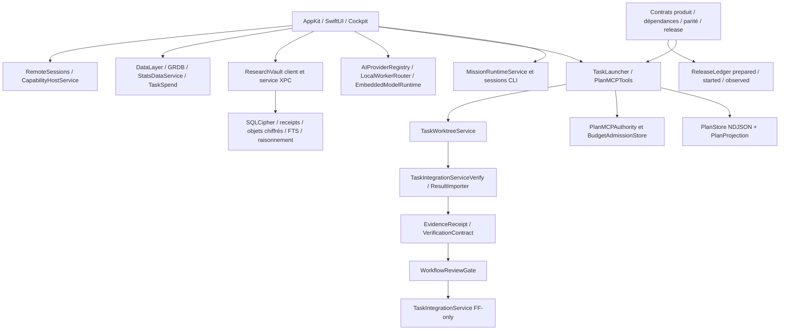

# Throttle — revue de recherche et d'architecture

Date : **20 septembre 2026** · Nature : revue documentaire et inspection statique · Statut : **recommandations prêtes à arbitrer, aucune implémentation autorisée par ce document**.

Les huit rapports ont été lus intégralement. Les sources primaires prioritaires ont été recherchées et recoupées avec le dépôt. La vidéo demeure inaccessible. Cette revue n'est pas une qualification de sécurité/runtime ni un GO de release. Aucun code applicatif, dépendance, configuration ou donnée produit n'a été modifié ; aucun build, test du produit, script de dépôt ou appel d'inférence n'a été exécuté.

Documents de détail, sans recopier leurs registres :

- [Manifeste des huit rapports](throttle-review-2026-09-20/input-manifest.json).
- [Sources, 32 claims, contradictions et questions A–M](throttle-review-2026-09-20/SOURCES_AND_CLAIMS.md).
- [Décisions, alternatives, coûts, acceptation et rollback](throttle-review-2026-09-20/DECISIONS.md).
- [Roadmap et quatre protocoles d'expérience](throttle-review-2026-09-20/ROADMAP_AND_EXPERIMENTS.md).
- [Index des chemins de code cités](throttle-review-2026-09-20/CODE_REFERENCES.md) : résolution des noms abrégés, branche et liens locaux.
- [Progression de la revue](throttle-review-2026-09-20/PROGRESS.md), [snapshot B](throttle-review-2026-09-20/current-snapshot.json), [snapshot C](throttle-review-2026-09-20/cockpit-snapshot.json).

## 1. Synthèse exécutive et décisions majeures

**Throttle a davantage besoin de fermer ses frontières d'exécution et de preuve que d'ajouter un moteur décisionnel.** La branche cockpit contient déjà une partie importante de l'architecture proposée par les recherches : WorkContract, machine à états, journal durable, grants MCP, réserve de vérification, receipts, review, manifests de release et évaluations de dépendances/réemploi/parité.

Le checkout courant est plus ancien. Prescrire depuis ce seul checkout aurait conduit à reconstruire ce travail. L'architecture recommandée conserve le cœur Swift natif et les workers remplaçables, utilise les contrats existants, puis corrige des lacunes concrètes : outils de lecture trop permissifs, builds délégués insuffisamment confinés, preuves pas complètement liées aux entrées matérielles, fenêtres de concurrence Git et identité de reviewer. La distinction intégré/publié est déjà respectée par les libellés EN/FR inspectés ; elle doit être conservée.

Les choix majeurs sont D01–18/D20 dans le registre :

| Sujet | Conclusion |
|---|---|
| Decision Engine | Aucun service distinct justifié maintenant ; fonctions de règles et gates existantes. |
| Autonomy Controller | Responsabilité nécessaire ; coordination centrale des politiques et contrôle effectif aux frontières, en étendant les grants existants. |
| DoD probabiliste | Rejet d'un score global ; obligations multidimensionnelles fondées sur preuves, unknown explicite. |
| Jev | Expérience étroite en observation seulement, après baseline et accès autorisé. |
| Evidence graph | Relations et provenance utiles ; journaux + stockage existant + projections, aucune base graphe imposée. |
| Temporal / architecture distribuée | Différés ; aucune nécessité démontrée pour le premier produit local. |
| Premier travail | D02 : unifier les outils de lecture et fermer la pseudo-sandbox, avant d'étendre l'autonomie. |

L'ambition reste le cycle produit complet, mais la première version autonome crédible traite **une tâche bornée sur un produit, avec preuve indépendante, contrôle d'effet et reprise explicite**. Elle peut ensuite étendre un parcours réel jusqu'à la release éligible. Les publications et communications restent des actes autorisés séparément.

## 2. État de référence et limites de l'audit

### Révisions et changements préexistants

Le workspace fourni est `/Users/kevinnadjarian/GitHub/Throttle`. Il a été inspecté en lecture seule avant création des documents. Aucun changement de branche n'a été effectué.

| Alias | Worktree observé | Branche / HEAD | Portée |
|---|---|---|---|
| **B** | `/Users/kevinnadjarian/GitHub/Throttle` | `feat/research-vault-lots-1-4` · `32988f4fc99071a95b3684efa9684b57c7d6e810` | Checkout de cette revue et destination des livrables. Initialement `?? .throttle/`, aucun diff suivi. |
| **C** | `/Users/kevinnadjarian/.claude/worktrees/throttle-project-overview` | `feat/cockpit-navigation` · `1ac0a32f02f2cce9707779e41118ea39e7eb97d7` | Inspection comparative des capacités récentes, sans écriture. Diff préexistant conservé. |
| **W** | `/Users/kevinnadjarian/GitHub/Throttle/build/workflow-contracts-8a91a20b` | `codex/workflow-contracts-8a91a20b` · `b2d03c226b7baaf8035ad67a2157f3d3856c939c` | Inventaire de contrats ; capacités ensuite vérifiées dans C. |
| **P** | `/Users/kevinnadjarian/GitHub/Throttle/.claude/worktrees/plan-store` | `feat/plan-store` · `42f26e91151fcfa3a38f03d590b288d9d2953861` | Inventaire historique, pas réaudité intégralement. |
| **M** | `/Users/kevinnadjarian/GitHub/Throttle-macos27-sota` | `feat/macos27-sota` · `6ed630fc4e9b8d5e24e1f2897652aa0e369d7802` | Cibles et prototype macOS27 examinés, pas preuve de livraison. |

Dans C, les changements préexistants concernent notamment `TaskSpend`, `ClaudeAgentInventory`, `OutsideAgentsCard`, `CockpitTodayView`, `ProjectFlowView`, le catalogue de chaînes, tests, `docs/TODO.md` et `project.yml`, avec `TaskSpendReadout` et `CockpitSpendViewTests` non suivis. Le JSON du snapshot conserve l'état exact ; ils ne sont pas le travail de cette revue. C indique 3.8.0/build226 ; B indique 3.5.0/build216. **Aucune de ces valeurs source n'établit la version distribuée.**

Inventaire Git maintenu hors artefacts générés/caches : B **654 fichiers suivis, 436 Swift, 106 chemins de tests** ; C **1299 fichiers suivis, 816 Swift, 231 chemins de tests**. Ce sont des nombres de fichiers, pas des nombres de tests exécutés. L'inspection est ciblée sur orchestration, autorité, preuves, stockage, routage et cycle produit ; elle n'est pas une lecture exhaustive de 816 fichiers. Les declarations/symboles ont orienté la sélection, puis les chemins décisifs ont été lus. Les noms seuls ne valent pas preuve de fonctionnement.

Exclus : caches `.build`, DerivedData, dépendances vendoriées, grands artefacts build, contenu utilisateur de `.throttle`, credentials, comptes fournisseurs. Les worktrees imbriqués sous `build/` ont été consultés explicitement comme dépôts, pas comme artefacts. Aucun secret n'a été lu pour ce rapport, aucun extrait de code privé n'a été envoyé dans une recherche web.

### Environnement réel

Lecture de métadonnées installées : macOS **27.0 / 26A428**, Xcode **27.0 / 27A266a**, SDK macOS/iOS/iPadOS via iPhoneOS/visionOS/watchOS/tvOS **27.0** présents. Pas de `xcodebuild` lancé pour cette mission. Les plists et interfaces du SDK constituent la preuve locale, S24 la disponibilité documentaire.

`B:project.yml:4,19` et C déclarent macOS **14.0**, Swift6 et strict concurrency ; iOS **17.0**, visionOS **26.0**. M comporte un target supplémentaire macOS27, sans relèvement global constaté. `ENABLE_USER_SCRIPT_SANDBOXING: NO` est déclaré dans B : c'est un réglage des phases de build, à ne pas confondre avec le sandbox d'exécution des agents ni avec Hardened Runtime.

`FoundationModels.swiftinterface` du SDK installé déclare `PrivateCloudComputeLanguageModel` disponible à partir de macOS27 et expose disponibilité, erreurs réseau/service et quotas. Sa présence ne prouve ni activation Apple Intelligence, ni quota utilisable, ni entitlement, ni comportement installé. Le backend PCC est distant même si l'API Swift est native. Le modèle sur appareil est une autre capacité. [Apple Foundation Models et nouveautés WWDC26](https://developer.apple.com/videos/play/wwdc2026/241/).

### Instructions et preuve historique

Les règles AGENTS fournies sur Global RAG ont été respectées : une recherche limit6 pertinente à cette revue, résultats utilisés comme pistes seulement. Les skills SOTA/deepsearsh ont fourni le protocole local-first ; leur import/reconstruction du corpus n'a pas été appliqué car hors périmètre autorisé. OpenAI Docs a servi aux comparaisons officielles des SDK. Aucun sous-agent n'a été lancé.

`B:CONTRIBUTING.md` décrit encore un ancien périmètre Meter et un petit inventaire de tests. C a déjà corrigé ce texte. Ne pas réintroduire cette dette en repartant de B sans comparaison. Les anciens handoffs ne peuvent pas élargir les autorisations de cette phase.

`C:docs/testing/2026-09-15-workflow-contract-increment.md:54` rapporte **253/253 core** et **846 cas macOS : 841 passed, 5 skipped**. Ce rapport date d'un état antérieur, mentionne lui-même des gates runtime/AX ouverts et des preuves devenues anciennes. Il a été lu ; les résultats n'ont pas été réexécutés ni requalifiés pour C+diff. Le pilote `docs/testing/pilot-10-tasks.csv` reste **0/10 observations**.

## 3. Manifeste des rapports et des sources

Les chemins réels, titres, SHA-256, tailles, lignes, états COMPLETE et limites bibliographiques sont dans le [manifeste](throttle-review-2026-09-20/input-manifest.json) et [l'annexe sources](throttle-review-2026-09-20/SOURCES_AND_CLAIMS.md). Aucun original n'a été modifié. Les huit empreintes sont distinctes ; beaucoup d'idées et d'études se recouvrent.

La vidéo n'a pas pu être récupérée et aucune transcription exploitable n'a été trouvée via recherche ciblée. L'article Eigent français n'a pas été récupéré, sa version anglaise officielle a été lue. Les pages TypeSafe utiles ont été consultées ; les échecs et redirections exacts sont consignés. Les marqueurs de citation opaques dans les huit rapports ne sont jamais présentés comme des liens primaires vérifiés.

## 4. Architecture réellement observée

### Vue d'ensemble

Cette vue représente les responsabilités observées, surtout C ; elle ne prouve pas que tous les flux sont actifs dans l'app installée. Le release ledger **n'invoque pas lui-même un fournisseur**. Les workers CLI restent des processus distincts avec leur propre historique et leurs propres permissions. Les objets Swift de politique ne constituent pas un OS sandbox.

### Constats traçables

| ID | Constat et implication | Preuve statique / tests présents | Niveau |
|---|---|---|---|
| F01 | Journal/machine à états/contrats existent déjà dans C. Ne pas reconstruire depuis B. | `C:PlanStore.swift:18–89,210–270`, `PlanProjection.swift:130`, `Models/PlanModels.swift`, `WorkflowWorkContract.swift:94` ; `PlanStoreCrashTests`, `WorkflowContractIntegrationTests`. | Structure et branches de contrôle vérifiées ; exécution actuelle non vérifiée. |
| F02 | `BashSandbox` autorise des binaires, pas une grammaire sûre de leurs opérations. Arguments bruts transmis à Process ; git/find peuvent avoir des effets. | B/C même fichier ; `BashSandbox.swift:53,117–173` ; `AssistantTools.swift:125–130`. Tests inspectés couvrent métacaractères/denylist, pas tous sous-commandes/actions. | Défaut de confinement confirmé statiquement ; exploitation NON EXÉCUTÉE. |
| F03 | `read_file` passe par une autre frontière : simple préfixe HOME puis lecture, sans la denylist de BashSandbox ni scope projet. | B/C `AssistantTools.swift:134–168`. Comparer `C:ProjectKnowledgeExplorer.swift:112–162` : root, refus liens, ouverture bornée. | Incohérence de contrôle confirmée ; aucune donnée sensible lue. |
| F04 | Build délégué n'est pas limité aux effets décrits par son nom ; repo choisi par nom, plugins/macros non validés, environnement hérité. `running` n'est ni lease machine ni mutex pour tous lanceurs. | B/C identiques, `CapabilityHostService.swift:40–53,128–158,164–176,179–203,216–220`. `readDataToEndOfFile` précède troncature, TERM sans escalade ici, erreur ACK absorbée par `try?`. | Chemin lu ; risques de scripts arbitraires/mémoire/retry à qualifier dans fixture. |
| F05 | Grants MCP bornés/expirants/révocables, mais coopératifs ; absence de grant acceptée sur voie legacy. Stockage même UID n'isole pas worker hostile. | `C:PlanMCPAuthority.swift:4–10,74–122,133–159`, `PlanMCPTaskRouter.swift:58–76`, `TaskLauncherAuthority.swift`; profil backend explicite. | Contrôles de surface vérifiés statiquement ; complète médiation OS non établie. |
| F06 | Receipts distinguent commande et inventaire de tests, lient contrats ; identité du sujet reste incomplète. | `WorkflowEvidenceReceipt.swift:46–49` hash des **noms** untracked ; `TaskIntegrationServiceVerify.swift:55–82,105–112` deux SHA, lookup xcresult par mtime ; `WorkflowEvidenceReceiptTests`. | Fonction utile mais preuve matérielle partielle. |
| F07 | Intégration FF-only revérifie obligations mais merge une branche nommée après assessment ; effet Git puis journal ne sont pas atomiques. | `TaskIntegrationService.swift:224–277` ; tests `TaskIntegrationWorkContractTests:27,48`. | Fenêtre concurrente et résultat inconnu après crash à qualifier ; pas de course exécutée. |
| F08 | Gate qualitatif applique critères séparément, mais « autre runtime » et chaînes d'identité ne prouvent pas l'indépendance/authenticité du juge. NA n'est pas preuve de pertinence. | `WorkflowReviewGate.swift:22–54,57–73,95–125`, `PlanProjection.swift:90`; `WorkflowReviewGateTests`. | Logique existante, confiance de l'acquisition partielle. |
| F09 | Plusieurs couches de routage ont des responsabilités distinctes. `DispatchAdvisor` est advisory et peut confondre absence de budgets avec tous épuisés. | `C:DispatchAdvisor.swift:3–7,22–73`; `MissionRuntimeService.resolve:199`, `DispatchBudget.current:15`, `AIProviderRegistry`, `LocalWorkerRouter`. | Règles inspectées ; pas benchmark de choix de modèles. |
| F10 | `integrated` devient `shipped` dans l'enum interne, mais le cockpit affiche déjà Integrated/Intégré et explique la fusion. Aucun défaut de libellé « publié » établi. | `C:PlanFlow.swift:21–28`, `Throttle/UI/Cockpit/Navigation/FlowWording.swift:14,33`, `Localizable.xcstrings:9468,9517`. | Hypothèse initiale réfutée par suivi du call site et du catalogue EN/FR ; runtime non testé. KEEP du libellé. |
| F11 | Budget admission protège déjà vérification/release et conserve la charge d'une réservation expirée jusqu'à reconciliation. Ne pas ajouter un deuxième budget engine. | `BudgetAdmissionStore.swift:184–220`, `TaskBudgetAdmission`, `BudgetAdmissionModels.countedAmount`; tests `testExpiredReservationBlocksUntilExplicitlyReconciled`, `testOrdinaryWorkCannotConsumeProtectedVerificationOrReleaseReserves`. | Invariants inspectés et tests présents ; plafond fournisseur externe non garanti. |
| F12 | Vault a déjà provenance, scoping, objets chiffrés, FTS, générations et raisonnement. | B `ResearchReceipt.swift`, `VaultAuthorization.swift`, `ResearchVaultGateway.swift:149,276,420`, `EncryptedObjectStore`; ADR0002 et tests de gateway/SQLCipher. | Capacité source partielle/large ; runtime signé et suppression bout en bout non qualifiés ici. |
| F13 | Release/product/dependency/reuse/parity ne sont pas absents : contrats et évaluateurs existent. Les side effects restent séparés. | C `WorkflowProductCycleContract.swift`, `WorkflowReleaseModels.swift:162–207,292`, `WorkflowReleaseLedgerStore.swift:53–59,88–120`, modèles dependency/technology/IP/platform. | Contrats vérifiés statiquement ; lifecycle autonome complet EXISTS_UNVERIFIED/PARTIAL. |

Les constats F02–F04 priment sur l'optimisation des modèles. La solution n'est pas d'ajouter un LLM qui classe ces mêmes commandes « sûres ». Les fonctions existantes de lecture de projet constituent une alternative plus petite et plus vérifiable.

Les explorations de TODO/stubs n'ont pas révélé à elles seules une carte fiable de la dette. Des commentaires décrivent parfois une garantie plus forte que le contrôle réel ; à l'inverse « stub » désigne souvent une compression de contexte volontaire. La dette importante ici est établie par les chemins de contrôle ci-dessus, pas par comptage des TODO.

## 5. Synthèse critique et contradictions

Les 32 affirmations CL01–32 sont enregistrées avec origine, méthode, population, preuve, contre-preuve, transfert et décisions. Les études de classification, mathématiques ou résolution d'issues n'établissent pas la réussite sur naming, UX, release ou maintenance. Les huit rapports ne sont pas huit expériences indépendantes.

Trois corrections changent directement la proposition :

1. **La granularité architecturale doit suivre les lacunes du code.** R1 simplifie, R2 multiplie les reviewers, R3 les étages appris, R7 ajoute Decision Engine, R8 choisit Temporal. C contient déjà les contrats nécessaires ; ce désaccord se tranche par réemploi et expériences, pas par majorité.
2. **Les oracles restent faillibles.** UTBoost montre des patches acceptés par des tests insuffisants dans son périmètre Python ; cela justifie une vérification de l'obligation, pas une confiance aveugle en tests générés supplémentaires. [Étude originale](https://arxiv.org/abs/2506.09289).
3. **L'indépendance ne se lit pas dans une marque.** L'étude ICML2025 établit des corrélations entre modèles sur ses tâches ; il faut mesurer le défaut attrapé conditionnellement au défaut raté par le worker, avec autres outils/critères/contexte si utile. [Kim et al.](https://proceedings.mlr.press/v267/kim25e.html).

Les hypothèses précédentes sur les trois « moteurs » ne sont pas reconduites comme décisions. Les résultats historiques de builds de cette conversation ne deviennent ni baseline produit ni autorisation de relancer Throttle.

## 6. Recherches complémentaires menées

Le registre Q-A à Q-M couvre les treize domaines demandés. Les inspections ont résolu les questions que le code pouvait trancher : présence de PlanStore, grants, réserves, receipts, release ledger, niveaux de DoD, scopes de lecture. Les recherches externes ont ciblé les frontières non résolues : idempotence, garanties de SDK, calibration, versions Apple, provenance et coût des modèles.

Résultats qui changent la décision :

- **Durabilité :** Temporal lui-même requiert de traiter le cas effet réalisé mais résultat non enregistré. Cela invalide « adopter Temporal = obtenir exactly-once » ; conserver local et tester l'effet inconnu. [Activity Definition](https://docs.temporal.io/activity-definition).
- **Contexte :** le Vault et la décision locale de reconstruction complète existent ; ne pas ajouter truth maintenance incrémentale ou mémoire externe sans benchmark.
- **Apple :** SDK27 réellement installé, cibles de produit antérieures ; le choix macOS27-only demeure produit. PCC expose des quotas, donc natif ne signifie pas gratuit illimité ni entièrement local.
- **Jev :** les limites officielles incluent contenu adversarial et absence d'invariants entre réponses distinctes. Une confidence élevée ne peut pas autoriser un effet. [Jev 1.13 jaggedness](https://docs.typesafe.ai/model-jaggedness/jev-1.13).
- **SDK :** scopes/approvals/hooks sont réutilisables, mais chaque chemin d'outil doit être contrôlé avant effet ; un guardrail parallèle peut agir trop tard. [OpenAI, guardrails](https://developers.openai.com/api/docs/guides/agents/guardrails-approvals).

La comparaison des alternatives porte sur leurs responsabilités :

| Besoin | Réemploi le plus simple | Alternatives examinées | Décision |
|---|---|---|---|
| Worker qui code | Claude Code/Codex déjà intégrés | Claude Agent SDK, Codex SDK/app-server, OpenHands, SWE-agent | WRAP l'existant ; qualifier un remplaçant sur tâche, pas migrer tout le lab. S28/30/31. |
| Durabilité produit | PlanStore + release effect ledger | Temporal, LangGraph checkpointer | ADAPT local ; DEFER serveur/double orchestration. S18/19. |
| Outils/multi-agent | Contrats et adaptateurs actuels | Agents SDK, AutoGen, CrewAI | Emprunter API utile ; aucun framework additionnel nécessaire maintenant. S29/34. |
| Optimisation de prompts/routage | Règles + données locales | DSPy, RouteLLM | EXPERIMENT après labels fiables. S32/37. |
| Mémoire | Vault/FTS/receipts | Letta, embeddings additionnels | KEEP ; mémoire conversationnelle non autorité. S33. |
| Preuves | Journal + objets + projections | PostgreSQL/base graphe/SLSA | ADAPT concepts PROV/SLSA selon risque ; pas changement de stockage. S21–23. |

Aucun de ces outils externes n'a été installé, exécuté ou autorisé à recevoir le dépôt.

## 7. Lacunes non résolues

**EXPÉRIENCE REQUISE :** confinement OS des chemins de build/CLI, protection du contrôleur contre même UID, acquisition authentique du reviewer, artefacts inaltérables, course Git, reprise disque plein/crash, quotas et contention réels, tests natifs UX/AX/localisation, coût accepté tous fournisseurs. Les protocoles E1–E4 précisent comment les résoudre.

**SOURCE INSUFFISANTE :** transcription vidéo, bibliographie opaque d'une partie des chiffres 2026, performances Jev sur tâches Throttle, qualité des besoins produit mesurée, inventaire CVE/SBOM complet et qualification juridique par composant.

**NON VÉRIFIÉ :** état distant des branches/protections, portail Apple, signature/notarisation/publication, app installée et appareils physiques dans cette mission. Les mentions historiques ne ferment aucun de ces points. Les budgets et dates des protocoles sont des propositions, pas des mesures.

Le rapport est utilisable pour choisir une première correction et rejeter les couches injustifiées. Il ne démontre pas que le produit peut déjà fonctionner sans supervision.

## 8. Cartographie des capacités et écarts

`EXISTS_VERIFIED` ci-dessous signifie **implémentation et invariants statiques effectivement inspectés**, pas succès runtime ; la colonne preuve distingue ce niveau. `PARTIAL` signale raccord ou garantie manquants. `EXISTS_UNVERIFIED` couvre présence sans qualification de parcours. `MISSING` est limité au périmètre inspecté, pas déduit d'un nom absent.

| Capacité | État | Base réelle / écart |
|---|---|---|
| App native macOS, UI sessions | EXISTS_UNVERIFIED | AppDelegate/AppKit/SwiftUI, CLI terminals ; pas parcours lancé. |
| Usage/coûts locaux | PARTIAL | GRDB/DataLayer/StatsDataService ; TaskSpend C garde inconnus ; coût total externe incomplet. |
| Contrats/version/critères | EXISTS_VERIFIED statique | WorkContract, vérification, recettes, design, product cycle dans C ; admission runtime à qualifier. |
| Task graph et projections | EXISTS_VERIFIED statique | PlanModels/PlanProjection/PlanStore ; plan peut rester mauvais produit. |
| Durabilité des événements | PARTIAL | Verrou+sync+replay+crash tests ; effets externes et Git hors transaction. |
| Worktrees et intégration | PARTIAL | Isolation de tâche et FF-only ; refs partagées, TOCTOU, crash après merge. |
| Permissions MCP | PARTIAL | Grants scoped/expiry/revoke ; legacy et OS droits distincts. |
| Outils read-only | OVERLAP / PARTIAL | Explorer borné vs AssistantTools/BashSandbox permissifs. D02. |
| Build distant servi par Mac | PARTIAL | CapabilityHost, opt-in ; containment/durabilité/ressources à corriger. |
| DoD fondée sur preuves | PARTIAL | Contracts, receipts, rubric ; couverture entrée/oracle/reviewer incomplète. |
| Challenger et remediation | PARTIAL | Review/rejection, RedTeamCampaignStore inventorié ; pas assurance indépendante de bout en bout. |
| Mémoire et provenance | EXISTS_VERIFIED statique / PARTIAL runtime | Receipt/VaultAuthorization/gateway/stockages ; signed XPC et suppression non qualifiés. |
| Routage et disponibilité | OVERLAP maîtrisable | Différents niveaux session/dispatch/inférence ; noms de capacité ≠ résultat live. |
| Admission et réserve de vérification | EXISTS_VERIFIED statique | BudgetAdmissionStore et tests ; aucun plafond fournisseur exact prouvé. |
| Scheduler global CPU/GPU/build | MISSING pour médiation universelle | Conseils mémoire et indicateur running ne couvrent pas tous processus. |
| Dependency Intelligence / réemploi | PARTIAL | Évaluations/gates structurés ; collecte/maintenance et supply chain réelles à compléter. |
| Tracks Apple/Android | PARTIAL | Contrats et parité présents ; pas produit Android fabriqué et qualifié ici. |
| Design/AX/localisation | PARTIAL | DesignContract, vues/xcstrings/tests ; besoin, fidélité et usage réel restent séparés. |
| Release/communication | PARTIAL | Manifests/gates/journal ; aucun effet autorisé/observé par cette revue. |
| Maintenance/feedback | EXISTS_UNVERIFIED | Updater, CrashReporter/ProductSignals ; boucle lab autonome non démontrée. |
| Baseline de tâches acceptées | MISSING | Pilote préparé, 0/10. |
| Jev / calibration de jugements | MISSING dans le périmètre inspecté | Ni nécessité ni calibration locale démontrées. |
| Isolation de l'auto-modification | UNKNOWN / PARTIAL | Empreintes et contrats utiles ; contrôleur/oracle inaccessible au worker non démontré. |

## 9. Verdicts Decision Engine, Jev, Autonomy Controller et DoD

### Répartition de l'autorité

| Responsabilité | Autorité recommandée |
|---|---|
| Format/identité/version/contraintes/intégrité | Types et validateurs déterministes, contraintes de stockage, transaction/journal. |
| Transitions de tâche | Machine à états Throttle ; worker propose candidate_complete. |
| Éligibilité de l'action | Politique versionnée : permissions, risque, scope, budget, preuve et réversibilité. |
| Respect de l'autorisation | Adaptateur/runner à la frontière d'effet, avec isolation adéquate. |
| Interprétation ambiguë / alternatives | LLM ou modèle spécialisé fournit observation/jugement, jamais grant. |
| Arbitrage de besoin, coût engagé, délégation durable, licence/publication | Opérateur habilité lorsque l'arbitrage dépasse le contrat actuel. |

Un Decision Engine autonome duplique routeur, gates et admission. Une petite fonction typée peut être utile dans E3 ; son besoin ne justifie pas un système général de décision.

Jev : **Choice** classe dans un ensemble fermé, **Score** produit une espérance sur niveaux ordonnés, **Noul** prédit une proposition oui/non. La concentration de distribution, sa calibration observée, le risque et le droit d'agir sont cinq objets différents. Les différences de scores entre fournisseurs n'ont pas de sens sans même proposition et calibration de domaine. [Choice](https://docs.typesafe.ai/primitives/choice), [Score](https://docs.typesafe.ai/primitives/score), [Noul](https://docs.typesafe.ai/primitives/noul), [Confidence](https://docs.typesafe.ai/confidence).

Le contrat éventuel conserve OTHER, INSUFFICIENT_INFORMATION, CONFLICTING_EVIDENCE et OUT_OF_SCOPE ; adaptateur distingue UNAVAILABLE et INVALID_OUTPUT. Ni indisponibilité ni donnée absente ne deviennent `false`, zéro ou autorisation de fallback moins privé. Le fournisseur ne génère pas les preuves manquantes. D10 détaille l'expérience ; aucune API appelée.

L'Autonomy Controller recommandé est une **responsabilité distribuée de façon cohérente** : politique/état centralisés dans Throttle, contrôle aux frontières réelles, aucune voie de contournement. AUTO_EXECUTE, CROSS_CHECK, SECOND_MODEL, ADDITIONAL_TESTING, CHALLENGE, RETRY, ROLLBACK, ASK_HUMAN, BLOCK désignent des suites possibles, pas neuf classes exclusives d'un modèle. D'abord interdictions ; ensuite informations manquantes ; ensuite exécution ; ensuite reprise. Une même tâche peut suivre plusieurs étapes.

La DoD exploite les contrats existants. PASS/FAIL/UNKNOWN/NOT_APPLICABLE correspondent à assertions localisées avec preuve et justification. Aucun taux global « 98 % terminé ». Une preuve manquante commande d'abord une collecte autorisée ; une contradiction produit ou une limite d'autorité peut appeler l'humain. Le worker ne choisit ni ses exemptions ni son certificat final.

## 10. Provenance, vérification, challenger et routage

### Dossier minimal et identité

Pour une décision : exigence/version, WorkContract, révisions, contenu des entrées matérielles utiles, observations natives, preuves favorables **et défavorables**, manques, contradiction, action proposée, scope/grant, politique/version, identité du producteur et mode d'acquisition. Résumé du worker = aide de lecture, jamais unique source. Un hash prouve identité, pas vérité.

Une modification du code, dépendances, exigences, politique, oracle ou artefact invalide les décisions dépendantes selon leur portée. Toute empreinte stockée doit avoir un consommateur explicite d'invalidation ; sinon elle devient décoration. Cache indexé par subject+contract+policy+oracle/backend version ; un résultat ancien ne peut être utilisé comme autorisation d'un nouvel effet.

Stockage minimal : conserver PlanStore pour workflow, release ledger pour effets release et Vault pour recherche/provenance. Objets volumineux hors événements, référence de contenu et ACL ; index/relations reconstruisibles. Une requête structurée sait répondre à « quels tests de ce candidat manquent ? » ; un embedding n'est pas l'autorité pour cette question. PROV apporte un vocabulaire, SLSA une provenance de build, aucune de ces références n'impose une base graphe ni une capture intégrale des prompts.

### Indépendance et budgets

Le vérificateur reçoit les exigences et artefacts normatifs, accède aux outils adaptés et peut constater FAIL/UNKNOWN. Un challenger cherche un contre-exemple situé, pas une opinion négative. Proportionner effort au risque et à la valeur de l'information ; pas de changement systématique de fournisseur pour une édition documentaire. Critère critique inconnu bloque. Modification de test/oracle doit rester visible et évaluée séparément sous règles antérieures.

Routage : filtrer par capacité requise réellement qualifiée, confidentialité, permission, disponibilité et budget ; classer ensuite les candidats. Local signifie adapté et disponible, pas automatiquement meilleur. Apple on-device, MLX et Ollama/LAN ont des contraintes différentes ; Claude/Codex sont aussi des runtimes de travail, pas uniquement des noms de modèles. Réserves pour vérification restent protégées même si un builder a épuisé son budget. D09/D12 étendent les mécanismes présents.

## 11. Impacts sur l'ensemble du cycle produit

| Domaine | Nécessaire maintenant | Fondation utile | Ambition ultérieure |
|---|---|---|---|
| Idée/recherche/veille | Besoin explicite, sources datées, alternatives | Vault et provenance reliés à requirement | Veille continue priorisée par feedback |
| Marché/naming/positionnement | Arbitrage sur cible et différenciation | Décision versionnée avec hypothèses | Tests de marché et intégration d'outils autorisés |
| Existant/import repo | Snapshot, instructions et préservation | Explorer + WorkContract + worktree | Modernisation multi-repo après preuve |
| Architecture/dépendances | Alternative simple et réemploi examiné | Dependency/reuse assessments | Catalogue entretenu sur composants réellement utilisés |
| Design/UX | Parcours, erreurs, AX et besoin | DesignContract + références visuelles | Design tools si interface disponible et utile |
| Implémentation | Worker borné, un propriétaire, scope | Reprise et preuves indépendantes | Parallélisme mesuré sur tâches découplées |
| Plateformes | Tracks intentionnels et exigences partagées | Parité fonctionnelle, adaptations natives | Android/watchOS/tvOS selon demande ; aucun port automatique |
| Release | Éligibilité du candidat et manifeste | Effect ledger et authorization distincts | Connecteurs par canal qualifié |
| Site/docs/marketing | Contenu exact, versions cohérentes, brouillons | Références au manifest et preuves | Publication uniquement selon autorisation |
| Maintenance | Erreur/incident lié au sujet livré | Feedback rouvre exigence, rollback spécifique | Boucle mesurée de priorisation autonome |

Throttle s'exécute sur macOS ; les produits fabriqués peuvent avoir d'autres cibles. Un worker Linux distant peut traiter du code portable ou Android s'il est qualifié, sans devenir l'autorité du produit ni remplacer les outils Apple. Les compagnons iOS/visionOS existants de Throttle ne prouvent pas qu'il sait fabriquer n'importe quelle app de ces plateformes.

## 12. Menaces et scénarios de défaillance

| Scénario | Défaut/conséquence | Contrôle et résultat attendu |
|---|---|---|
| README/page/MCP injecte instruction | Détournement d'outil ou exfiltration | Donnée non autorité, outil à scope contrôlé, provenance du contenu. D02/D04. |
| Commande présentée comme lecture | Mutation via flags/sous-commandes | Grammaire fermée ou fonctions natives ; aucune confiance au nom bash/build. |
| Dépendance/Package.swift/script hostile | Code exécuté pendant build | Runner sans credentials, scope FS/réseau et validation de source ; refus si contrôle indisponible. |
| Même UID réécrit journal/grant | Hash chain réécrite, rôle falsifié | Frontière OS/stockage hors portée worker, identité d'acquisition ; ne pas appeler chmod700 une séparation de principals. |
| Worker sélectionne ses preuves | Faux PASS et test neutralisé | Critères fixés avant, oracles protégés, artefacts acquis par verifier. |
| Cache de décision ancien | Exécution sur mauvais état | Sujet/politique/oracle/version dans cache et revalidation juste avant effet. |
| Branche modifiée après check | Merge d'un candidat non testé | Identité immutable et contrôle final, isolation/queue ; E4. |
| Crash après merge avant event | État Git/journal divergent | Intent durable puis reconciliation des SHA, pas retry aveugle. |
| Réseau tombe après effet externe | Doublon lors de retry | outcome_unknown, lookup provider/idempotence si disponible ; blocage sinon. |
| Cancel après effet parti | Annulation déclarée mais effet réussi | Stop des nouveaux départs ; observer effet, compensation spécifique si autorisée. |
| Disque plein / ligne déchirée | Perte d'ACK ou journal corrompu | Admission arrête, corruption visible, préservation intacte, reprise validée ; aucun clean/reset. |
| Réservation expirée et vieux worker actif | Deux propriétaires | Fencing + identité d'exécution ; expiration de temps seule n'est pas mort du worker. |
| GPU/mémoire saturés | OOM, UI bloquée, queue affamée | Admission partagée, tailles/concurrence bornées, réserve de vérification ; pas modèle plus gros par défaut. |
| Fournisseur/down/429 | Boucle de retries, fuite de fallback | Cause distincte, délai/circuit breaker et budget ; aucun fallback moins privé sans droit. |
| Reprise après plusieurs jours | Modèle/prompt/corpus différents | Snapshot sémantique/versionné ; changement explicite, revalidation, pas prétendu replay exact d'un LLM. |
| Milliers d'actions | Replay quadratique, log énorme, accumulation erreurs | E4, checkpoint/projection reconstruisible seulement si mesure justifie ; budgets profondeur/retries/fan-out. |
| Bonne calibration moyenne / OOD rare | Faux sentiment de sécurité | Tests par tranche, abstention, conséquences impératives hors score. |
| Budget builder épuisé | Vérification supprimée pour finir | Réserve déjà existante, arrêt utile, statut candidat non accepté. |
| Auto-modification du juge | Système affaiblit son acceptation | N évalue N+1 dans environnement séparé, politique et corpus non éditables. |
| App compile, mauvais besoin | Produit inutile ou parcours inaccessible | Requirement indépendant, tâche d'utilisabilité et états dégradés ; aucun build comme substitut. |

Le contrôleur peut lui aussi tomber en panne. La politique sûre est de refuser de nouveaux effets si autorité/état indisponibles, tout en conservant l'observation/réconciliation et les moyens d'arrêt. Une panne du contrôleur ne justifie pas un fallback permissif dans chaque worker.

## 13. Contre-audit et simplification

La proposition minimale a été attaquée à son tour :

- **« PlanStore suffit donc rien à faire » est faux.** Il sérialise les événements coopératifs ; il ne rend pas atomique un effet Git ou distant. D08 reste nécessaire, mais deux adaptateurs concrets précèdent toute abstraction générale.
- **« Le Vault est déjà sécurisé donc y mettre toute preuve » est trop large.** Les règles d'accès, d'autorité et de rétention des logs de build ne sont pas forcément celles de la recherche. Relier les objets avant de déplacer les données.
- **« Une signature résout les faux receipts » est insuffisant.** Elle authentifie un producteur, pas le bon oracle ; clé et producteur doivent être hors contrôle du worker.
- **« Fermer le shell retire de l'autonomie » dépend du besoin.** La tranche 1 conserve les lectures utiles ; un build suit une autre permission et un runner contrôlé. Réouvrir le shell générique n'est pas le rollback sûr.
- **« Tout doit passer par un service central » peut créer un point unique de blocage.** Centraliser l'état/politique ne signifie pas réseau obligatoire ; frontières locales imposent le droit et peuvent refuser si l'état manque.
- **« Plus de preuves » peut coûter plus que la tâche.** Recettes proportionnées, dossier minimal, données sensibles minimisées, budget reviewer séparé. Une tâche documentaire peut être validée statiquement.
- **« Le reviewer doit être d'un autre fournisseur » favorise une marque et un coût sans garantir l'indépendance.** Garder la barrière actuelle jusqu'au remplacement qualifié ; mesurer des mécanismes d'indépendance, pas supprimer le garde-fou sans tests.
- **« Un enum shipped révèle un affichage mensonger » était une inférence erronée.** Le suivi jusqu'à `FlowWording` et au catalogue EN/FR la réfute. F10 conserve cette contre-preuve ; aucun renommage UI n'est prescrit sur cette seule base.
- **Les renvois entre décisions ne doivent pas devenir un cycle de dépendances.** D04 pose l'admission minimale avant D08 ; D08 est appliqué au build avec D03 en S2, puis à Git avec D05 en S3. La roadmap explicite ces sous-ensembles ; aucun composant ne doit attendre sa propre qualification indirectement.

Complexité ajoutée retenue : contrôle de lecture unique, intents/réconciliation pour effets réels, identité de sujet plus complète, preuve d'acquisition et baseline. Complexité rejetée : nouveaux services pour chaque nom métier, base graphe sans workload, apprentissage online avant labels, migration distribuée pour un Mac unique, probability-of-done globale. Chaque couche retenue a un défaut observé, un test proposé et un critère de retrait dans D01–18/D20.

## 14. Architecture minimale et extensions justifiées

### Minimum Viable Autonomous Throttle

Quatre responsabilités logiques, **pas quatre nouveaux services** :

1. **Contrat et état durable** : WorkContract/PlanStore/PlanProjection, autorité de transition déterministe, projet/version et budgets.
2. **Exécution bornée** : workers CLI/adaptateurs existants, grants aux frontières, scope de fichier/réseau, budget et réservation machine ; absence de contrôle affichée.
3. **Preuve et acceptation** : acquisition d'artefacts par runner/verifier, receipts/contracts/rubrics, reviewer proportionné, intégration exacte et effets réconciliés.
4. **Interface produit et mémoire** : cockpit/Vault/stats, besoin et preuves lisibles, coûts/manques visibles, autorisations concrètes, supervision et feedback.

Les frontières sont : contenu externe→dossier ; worker→outil ; outil→OS/service ; preuve acquise→gate ; gate→effet autorisé ; état durable→projection UI. L'opérateur décide les limites réelles, pas chaque étape mécaniquement sûre. Le budget et les critères sont des entrées de politique, jamais des suggestions du worker.

### Parcours et conditions de transition

| Transition | Acteur / logique | Données et condition | Inconnu/échec |
|---|---|---|---|
| Requirement → Planning | LLM propose, propriétaire accepte le besoin si ambigu | Sources, cible utilisateur, critères observables, exclusions | Collecte ciblée ou arbitrage produit ; ne pas coder une supposition. |
| Planning → WorkContract | Code valide + opérateur pour changement de scope | DAG révisable, objectifs, entrées, livrables, budgets, stops | Contrat invalide/ref requis absent : refus d'admission. |
| Contract → Risk assessment | Politique déterministe, modèle conseil seulement | Effets, réversibilité, rayon, sensibilité, enjeu | Classe inconnue : périmètre borné/inspection, pas auto-exécution à haut risque. |
| Risk → Model/resource selection | Router/admission existants | Capacité, availability, privacy, quota, mémoire, réserve | Attente ou backend autorisé ; aucun downgrade sécurité. |
| Selection → Permission allocation | Autorité Throttle / humain si scope nouveau | Identité, cible et état exacts, expiry, revocation, capability | Grant absent/invalide : BLOCK avant effet. |
| Permission → Execution | Runner applique | Recheck grant/state, lease/fencing, intent durable | Refus/cancel visible ; effet démarré non attesté = unknown. |
| Execution → Evidence | Collecteur contrôlé | Résultat natif, contenu/artifact/run, échecs et omissions | Incomplete ; collecte autorisée ou reconciliation. |
| Evidence → Independent verification | Oracle déterministe + reviewer proportionné | Obligations protégées, même sujet, contexte indépendant | FAIL/UNKNOWN obligatoire bloque ; finding contextualisé. |
| Verification → Challenger | Politique de risque/échantillonnage | Contradiction, frontière critique, budget restant réservé | Remediation bornée, sinon blocage expliqué. |
| Review → Completion | Gate déterministe | Toutes obligations applicables satisfaites, aucun blocage | Candidate reste candidat, pas jugement du worker seul. |
| Completion → Merge eligibility | TaskIntegrationService renforcé | Candidat exact, base actuelle, scope, contrats, review | Rebase/revalidation ; aucun merge de branche mobile non revérifié. |
| Merge → Release eligibility | Release evaluator | Source/artifact/manifest/canal, tests/UX/compliance/media requis | Gate notVerified bloque, sans appel fournisseur implicite. |
| Eligible → Publication | Effecteur autorisé, humain selon grant | Autorisation exacte manifeste/payload/target/audience valide | Pas d'effet sans droit ; started sans observed à réconcilier. |
| Published → Monitoring/maintenance | Observations + politique/produit | Version publique constatée, feedback/incident/repro | Mitigation/rollback spécifique, nouvelle exigence si besoin faux. |

### Contrats minimaux : réemploi plutôt que nouvelles tables

| Objet demandé | Mapping existant / extension strictement nécessaire |
|---|---|
| Requirement / WorkContract | `WorkflowRequirement`, `WorkflowWorkContract` : IDs, revision, critères, base, paths et obligations déjà présents. Ajouter propriétaire/approbation acquise via référence attestée, pas champ libre magique. |
| AgentExecution / ModelExecution | Mission/runtime/session et traces/costs existants ; relier attempt/model/version au run, permissions et issue. Historique natif conservé. |
| ToolExecution / PermissionGrant | Grants MCP et authorization release ; adapter intent/result/subject et enforcement observé pour outils manquants. |
| Evidence / Claim | Workflow receipts pour exécution, ResearchReceipt/findings pour recherche ; relation typée, temps/fraîcheur/provenance, pas table universelle obligatoire. |
| Decision / Verification / Finding | Events checked/verdict et WorkflowReviewReport, SecurityFinding ; auteur/canal fiable, versions et références, supersession sans effacement. |
| Commit | SHA Git et sujet exact vérifié ; relation à intégration observée, pas nouvelle copie du dépôt. |
| Dependency | WorkflowDependencyAssessment et TechnologyCatalogEntry ; source/version/licence/gates/péremption. |
| Release | Manifest gelé, gates, authorization, ledger d'effets ; chaîne de versions et résultat externe. |

Invariants à imposer : IDs uniques, références existantes, schema connu, ordre de transitions, révision attendue, idempotency key et payload identiques, budgets conservatifs, expiration/révocation, obligations non compensables, NA autorisé, digest de candidat et contrat concordants. Types/validateurs puis transaction locale peuvent les imposer ; aucun appel LM n'est nécessaire pour cette validation.

Extensions justifiées seulement après preuve : projection SQL pour agrégations volumineuses, runner isolé multi-host si charge/demande réelles, autre SDK de worker si meilleur résultat mesuré, classifieur/Jev en shadow puis adoption bornée. Il n'existe pas d'état final inévitable à vingt composants.

## 15. Migration et roadmap priorisée

La [roadmap](throttle-review-2026-09-20/ROADMAP_AND_EXPERIMENTS.md) détaille chaque tranche : objectif, prérequis, chemins réels/proposés, données, exclusions, tests, indicateurs, rollout, rollback, DoD et gate suivant.

Ordre : **S0 checkout → S1 lectures sûres → S2 exécution/reprise → S3 preuve/intégration → S4 review/supervision → S5 un parcours produit/release**. Baseline dès S0 ; intelligence adaptative après observations. Les mécanismes existants dans C doivent être repris comme base, pas transplantés à l'aveugle dans B. La migration de formats est additive et les données anciennes conservent leur niveau de preuve limité. Aucun format historique n'est promu par défaut.

Priorités : P0 sécurité/intégrité/récupération avant nouvelles actions ; P1 autonomie fiable et qualité produit ; P2 optimisation mesurée ; P3 expérience Jev/autres candidats. La construction et la maintenance comptent toutes deux. Les tailles de travail sont des estimations avec hypothèses, aucun gain en pourcentage n'est inventé.

## 16. Baseline, mesures et expériences

Les protocoles E1–E4 sont conçus, **NON EXÉCUTÉS** : baseline, utilité marginale du challenger, triage Jev en observation, durabilité/effets. Chacun identifie hypothèse falsifiable, décision, baseline/traitement, dataset/splits, oracle, métriques, erreurs critiques, budget, procédure reproductible, incertitude et règles d'arrêt.

Mesure principale : succès réellement accepté de bout en bout et coût total par tâche acceptée, avec temps humain, défauts échappés, recovery et droits respectés. Inclure échecs et annulations. Si coûts non observés, publier la couverture et une borne connue, pas un total fabriqué. Aucun taux de succès issu du nombre de tests unitaires.

Pour apprendre le routage, expliciter le biais du modèle choisi ; shadow/replay apparié ou exploration autorisée à faible risque, jamais pseudo-label « les autres auraient échoué ». Calibration par proposition/cohorte/version, Brier/log loss/fiabilité/risque-couverture lorsque approprié. Ni calibration moyenne ni zéro erreur sur petit corpus ne prouvent la sûreté des cas rares ou hors distribution.

## 17. Arbitrages humains réellement nécessaires

H1 : checkout d'implémentation et première tranche autorisée. H2 : stratégie de licence/propriété et périmètre publiable par composant. H3 : clientèle/versions minimales/expansion de plateformes. H4 : données, accès, budget et périmètre d'actions pour expérience externe ou délégation future.

Ces décisions ne bloquent pas la revue. Elles bloquent les actes correspondants. La présence de LICENSE MIT et d'anciennes présentations commerciales appelle réconciliation par le propriétaire ; ce rapport ne conclut pas juridiquement à une violation. Aucun engagement externe, modification de licence ou publication n'est proposé comme action implicite.

## 18. Première tranche d'implémentation proposée

**S1 / D02 : remplacer les deux frontières de lecture divergentes par une voie de lecture de projet contrôlée, et fermer les opérations non démontrablement read-only de BashSandbox.**

Périmètre : `AssistantTools`, `BashSandbox`, raccord à `ProjectKnowledgeExplorer`, tests de cette frontière. Pas Jev, pas migration de stockage, pas nouveau moteur, pas relance de l'app ou archive. La racine autorisée vient du contexte de projet et de la permission, jamais du contenu fourni par un modèle. Les lectures légitimes restent possibles ; les autres appels indiquent exactement la capacité manquante.

Le livrable d'implémentation futur est un diff limité, des tests de refus sans effets réels et de lectures synthétiques réussies, plus une revue des call sites. Le rollback conserve une lecture minimale sûre. L'autorisation devra préciser checkout, périmètre de fichiers et exécutions de validation permises. L'approbation de cette revue seule ne l'accorde pas.

## 19. Validation de la revue elle-même

Le [reçu de validation documentaire](throttle-review-2026-09-20/validation.json) conserve les contrôles réellement exécutés et leur portée. Il ne constitue pas un résultat de test du produit.

| Critère | Résultat |
|---|---|
| Huit rapports lus, chemins/titres/empreintes/état | Oui, manifeste ; dates rédaction inconnues et citations opaques signalées. |
| Dépôt identifié et travail préservé | B/C/W/P/M distingués, snapshots et diff préexistant ; aucune mutation produit. |
| Périmètre statique explicite | Inventaire maintenu, chemins décisifs et tests inspectés ; aucune prétention d'audit exhaustif runtime. |
| Sources importantes vérifiées | TypeSafe primaire, durabilité, sécurité, calibration, SDK et Apple ; vidéo et chiffres résiduels signalés. |
| Questions complémentaires prioritaires menées | Q-A à Q-M, résultats et résiduels ; recherche arrêtée au point où expérience/arbitrage nécessaires. |
| Décisions traçables et alternatives simples | CL/F/S → D ; coûts/risques/dépendances/acceptation/abandon/migration/rollback documentés. |
| Revue hostile de la proposition | §12–13 et protocoles de défaillance ; couches fusionnées/différées/rejetées. |
| Plan incrémental et mesurable | S0–S5, E1–E4 ; première tranche limitée, produit utilisable en supervision. |
| Autorité/confidentialité/budgets | Documents seulement ; originaux conservés, aucun compte/secret/API d'inférence sollicité, aucune publication. |
| Tests réellement exécutés | **Aucun test applicatif/build/script de dépôt.** Contrôles documentaires de hashes, références, JSON, état Git uniquement. |

**Conclusion de portée : revue de recherche et d'architecture terminée dans le périmètre documentaire décrit, avec une lacune de source vidéo et des hypothèses expérimentales explicitement ouvertes. Qualification d'exécution, sécurité complète, UX réelle et release : NON EXÉCUTÉES / non acquises.**

### À CONSERVER

Cœur Swift natif, PlanStore/PlanProjection, WorkContract/receipts/gates, Vault, workers remplaçables, TaskSpend/ClaudeAgentInventory/StatsDataService et réserves existantes.

### À MODIFIER OU SIMPLIFIER

Frontières des outils, grants jusqu'aux effets, identité des preuves, intégration Git, indépendance des reviews, explications du routeur et états du cockpit.

### À IMPLÉMENTER MAINTENANT

Première correction bornée des lectures et du lanceur pseudo-read-only, après autorisation d'une tranche. Puis exécution/recovery P0 selon roadmap ; aucun code écrit par cette revue.

### FONDATIONS À POSER

Intents/réconciliation des effets gérés, provenance d'acquisition, protection de l'auto-modification, baseline et raccords au cycle produit existant.

### À EXPÉRIMENTER

Challenger proportionné, triage Jev/local/LLM/règles en observation, tests de panne et mesures de contexte/routage sur tâches représentatives.

### À DIFFÉRER

Temporal/distribution globale, routage appris et RL, nouvelles plateformes sans besoin validé, connecteurs de publication et mémoire auto-évolutive.

### À REJETER

Decision Engine autonome sans responsabilité distincte, DoD globale probabiliste, confiance valant permission, base graphe obligatoire, multiplication permanente des agents, publication fondée sur un avis de modèle.

### DÉCISIONS HUMAINES REQUISES

Checkout et autorisation S1 ; propriété/licence publique ; cible clients/OS/plateformes ; données/budget/délégation des expériences et actions externes. **Arrêt avant toute modification de code.**
