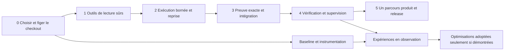

# Migration, premières tranches et expériences

[Revue principale](../THROTTLE_RESEARCH_ARCHITECTURE_REVIEW.md) · [Décisions](DECISIONS.md)

**Tous les tests et expériences de cette annexe sont NON EXÉCUTÉS pendant la revue.** Les budgets ci-dessous sont des bornes proposées pour une autorisation ultérieure, pas des ressources engagées. Les chemins C sont les fichiers observés du cockpit ; tout nouveau fichier est explicitement proposé. Les exemples d'état sont des contrats proposés, pas de nouveaux types déjà présents.

## Dépendances et déploiement progressif

La baseline commence dès le choix du checkout, sans activer de routage appris. Les P0 conditionnent toute extension d'autonomie. Le produit existant reste utilisable en mode supervisé ; une capacité non qualifiée peut être indisponible plutôt que permissive.

Ordre interne sans cycle : S2 commence par l'admission minimale D04, puis l'intent/réconciliation D08 et son runner build D03. S3 complète D05 et le raccord Git de D08. La protection minimale des oracles D18 précède ces vérifications ; son évaluation à plus grande échelle utilise ensuite D17. Les renvois croisés du registre expriment des interfaces ou qualifications communes, pas des services devant tous exister avant le premier. S0 ouvre l'inventaire baseline ; S3 rend l'acquisition fiable ; S4 exploite les comparaisons.

## Tranche 0 — établir la base d'intégration

- **Objectif :** éviter de reconstruire le travail présent dans C et préserver les changements concurrents.
- **Prérequis :** H1, choix explicite du worktree d'implémentation et du diff autorisé. Revue dans B ne signifie pas migration de C vers B.
- **Modules :** `project.yml`, docs/tests, `PlanStore`, contrats, outils ; comparaison des snapshots fournis. Aucun fichier applicatif nouveau requis.
- **Données :** inventaire des tâches legacy, schemas et artefacts requis ; aucune migration implicite de `.throttle`.
- **Exclus :** merge/push/release, relance de l'app, reprise des scripts d'archive du 18 septembre.
- **Preuves :** HEAD/branche/diff, hash des sources sélectionnées, disponibilité des fixtures et outil Xcode choisi ; tests historiques annotés historiques.
- **Indicateur :** zéro source préexistante perdue, zéro capacité dupliquée. Mode non expérimental.
- **Déploiement/rollback :** documentation du checkout, aucun produit modifié. **DoD :** périmètre et preuve de référence approuvés ; passage à S1 après définition de la racine autorisée de l'assistant.

## Tranche 1 — lectures de projet contrôlées

- **Objectif utilisateur :** l'assistant consulte le projet sans disposer d'un shell pouvant écrire ou lire les credentials du compte.
- **Prérequis :** S0 ; permission scope déterministe transmis depuis le contexte projet. Ne pas décider qu'un chemin présent dans le prompt vaut autorisation.
- **Fichiers observés :** `Throttle/Services/AssistantTools.swift`, `BashSandbox.swift`, `ProjectKnowledgeExplorer.swift`, `ProjectKnowledgeExplorerSearch.swift`, `ProjectKnowledgeExplorerReceipt.swift`, tests `BashSandboxTests.swift` et tests de l'explorer à localiser dans le checkout retenu. **Ajout éventuel proposé :** une petite représentation typée d'opération de lecture si les signatures existantes ne suffisent pas ; pas de service réseau.
- **Données/migration :** aucune migration de base ; ancien appel unsafe renvoie un refus structuré. Les noms d'outils peuvent rester compatibles.
- **Exclus :** nouveaux outils d'écriture, compilation de repo, shell arbitraire, modification de politique utilisateur, OS sandbox global.
- **Tests/preuves :** fixtures temporaires synthétiques seulement. Vérifier qu'une commande refusée ne crée aucun processus. Mutations Git, options d'exécution/suppression de find, fichiers hors racine, racine voisine au préfixe commun, lien vers hors scope, fichier factice classé sensible, changement concurrent de chemin, fichier trop gros/non régulier. Tester aussi lectures et recherches légitimes avec espaces, Unicode et erreurs explicites. Revue de la nouvelle frontière par fichier et call site.
- **Indicateurs :** nombre de chemins d'accès non médiés = 0 dans ce périmètre ; refus légitimes observés séparément des attaques bloquées ; bytes/temps bornés. Aucun LM requis.
- **Progression :** activer pour l'assistant projet, garder un état indisponible pour scope manquant. **Rollback :** fonctions natives de lecture minimale et refus générique ; ne pas rétablir les opérations unsafe.
- **DoD :** parcours de lecture utile préservé, tous accès testés passent par même frontière, assertions négatives et positives terminées, preuves liées au diff final. **Passage S2 :** aucune faille P0 de S1 ouverte. Cette tranche ne prétend pas rendre tout Throttle sandboxé.

## Tranche 2 — build géré, ressource réservée, résultat récupérable

- **Objectif opérationnel :** un build délégué possède un propriétaire, un créneau, un résultat durable et une issue connue après panne.
- **Prérequis :** S1 ; D04 contrôle de l'admission et stratégie d'isolation documentée. Autorisation spécifique pour les scripts de build et l'environnement de qualification.
- **Fichiers observés :** `CapabilityHostService`, `TaskIntegrationServiceVerify`, `TaskIntegrationVerifyChild`, `PlanStore`, `BudgetAdmissionStore`, `BackendCapabilityProfile`, `WorkflowReleaseLedgerStore` (pattern à réutiliser, sans mélanger identités release/build).
- **Données proposées :** intent de build versionné, subject fingerprint, grant, lease machine avec fencing, timestamps monotones pour délais locaux et dates persistées pour reprise, état préparé/démarré/observé/inconnu. Migration additive ; requêtes legacy restent non attestées.
- **Exclus :** worker Linux imposé, arrêt de processus appartenant à d'autres sessions, exactly-once universel, upload/signature/publication, restart Throttle non accordé.
- **Preuves :** faux serveur local, builds synthétiques hors dépôt privé, crash avant/après spawn et ACK, faux succès, ENOSPC, sortie très volumineuse, descendant qui ignore TERM, cancellation, lease expirée mais writer encore vivant. Vérifier identité du processus possédé avant signal ; pas PID seul après reboot.
- **Indicateurs :** aucun doublon silencieux, temps de récupération, tâches outcome_unknown visibles, maximum un xcodebuild **géré** ; processus externes détectés et admission différée. Un lock coopératif ne garantit pas exclusivité contre tous les logiciels du Mac.
- **Progression :** un seul hôte et un seul type de build, puis test. Mode observation de réservation avant enforcement ; enforcement uniquement une fois qualifié.
- **Rollback :** stopper nouvelles admissions, révoquer grants et réconcilier exécutions en vol ; mode manuel préservé. **DoD :** E4 sur ce périmètre, aucune annonce de succès sur résultat inconnu, scopes et mémoire bornés. **Passage S3 :** effets et preuves attribuables à un run.

## Tranche 3 — vérifier puis intégrer exactement le candidat vérifié

- **Objectif :** aucun état de code différent ne profite d'une preuve antérieure.
- **Prérequis :** S2 et définition des entrées matérielles de vérification par recette ; D18 protège oracles/contrôleur.
- **Fichiers observés :** `WorkflowEvidenceReceipt`, `WorkflowClaimContract`, `WorkflowResultImporter`, `TaskIntegrationServiceVerify`, `TaskIntegrationService`, `WorkflowWorkContract`, `ProjectInstructionService`.
- **Données :** version de receipt additionnelle, digest du contenu des entrées nécessaires, chemin d'artefact unique par run, identité/version du producteur et de l'acquisition, référence au commit/merge candidat et au contrat. Pas d'empreinte de tous les secrets d'environnement. Aucun nouveau graphe de stockage.
- **Exclus :** test complet de tous produits, preuve formelle de tout le code, fichiers ignorés sans impact sur la recette, réécriture Git.
- **Tests/preuves :** modifier un fichier non suivi sans renommer, substituer/retoucher un vieux xcresult, changer commande/lockfile/policy/rubric, gate modifié en concurrence, branche avancée juste avant merge, hook Git à effet inattendu, crash après FF avant event. Tests du commit effectivement intégré et preuve de réconciliation.
- **Indicateurs :** faux PASS acceptés = 0 sur corpus de défauts, taux d'invalidation justifiée, coût de fingerprint, délai d'intégration.
- **Déploiement :** stricte preuve sur nouvelles tâches gérées, anciens reçus consultables à portée limitée. **Rollback :** supprimer la promotion automatique, conserver les formats/lecteurs ; pas convertir ancien en valide.
- **DoD :** reçu manquant/incomplet/ancien ne ferme pas obligation ; oracle non modifiable par worker ; rollback sans perte d'historique. **Passage S4 :** sujet stable et preuves fiables à présenter au reviewer.

## Tranche 4 — review utile et cockpit honnête

- **Objectif :** savoir ce qui est accepté, ce qui manque et qui peut décider la suite.
- **Prérequis :** S3, rubriques correspondant à un vrai besoin, scopes de reviewers.
- **Fichiers :** `WorkflowReviewGate`, `WorkflowReviewModels`, `WorkflowDesignContract`, `PlanProjection`, `PlanFlow`, vues cockpit existantes, `TaskSpend`, `StatsDataService`, `ClaudeAgentInventory`.
- **Données :** attestation d'exécution reviewer et evidence provenance ; dimensions indépendantes ; raisons de NA évaluées. Conserver Integrated/Intégré déjà vérifiés dans FlowWording et le catalogue ; aucun renommage requis par l'enum interne shipped.
- **Exclus :** swarm de reviewers, score global de qualité, nouvelle implémentation parallèle de stats/inventory, promotion de rôle human depuis JSON non authentifié.
- **Tests :** worker proposant son propre verdict, même fournisseur mais contexte/oracle séparés, autre fournisseur avec même preuve corrompue, revue ancienne, FAIL/UNKNOWN obligatoire, NA injustifié, timeout et budget épuisé. UI : clavier, VoiceOver, ordre de focus, EN/FR, empty/loading/error, coût inconnu, preuve inaccessible, annuler/révoquer ; comparaison visuelle puis tâche d'utilisabilité.
- **Indicateurs :** défauts échappés, précision des findings actionnables, minutes humaines, p95 de review et coût additionnel. Expérience E2 avant généralisation du challenger.
- **Déploiement/rollback :** recette à risque ciblé ; revenir à reviewer simple + contrôles déterministes si E2 échoue. **DoD :** aucune dimension obligatoire masquée, aucun intégré affiché publié, aucune approbation sans sujet exact. **Passage S5 :** verdict compréhensible et récupérable.

## Tranche 5 — un parcours produit jusqu'à release éligible

- **Objectif :** partir d'un besoin réel, produire une amélioration utilisable et un candidat documenté ; observer ensuite feedback/incident.
- **Prérequis :** S4, produit/plateformes/canal choisis, H2 si distribution, aucune autorisation de publication déduite de l'éligibilité.
- **Fichiers :** `WorkflowProductCycleContract`, `WorkflowPlatformModels`, `WorkflowDependencyModels`, `WorkflowTechnologyReuseModels`, `WorkflowReleaseModels`, `WorkflowReleaseLedgerStore`, `ProductSignals`, docs et services de mise à jour existants.
- **Données :** relier exigence/recherche/choix de réemploi/track/manifest/artifact/observation ; champs inconnus explicites. Ne pas créer douze tables par correspondance de noms.
- **Exclus :** toutes plateformes simultanément, marketplace, campagne marketing automatique, publication sans accord, engagements cloud.
- **Preuves :** exemple produit existant et nouveau projet limité ; scénario « mauvais besoin mais tests verts », divergence Apple/Android justifiée, dépendance gate inconnu, version/build incohérent, manifest modifié après accord, effet started sans observed, rollback canal spécifique.
- **Indicateurs :** succès vérifié du parcours, interventions utiles, incident échappé, temps/coût accepté. **Déploiement :** canal manuel assisté d'abord ; effecteur automatisé seulement après qualification et autorisation séparée.
- **Rollback :** conserver ancienne distribution, suspendre nouvel effet, compensation spécifique ; pas de promesse d'annuler un message ou une installation. **DoD :** preuve d'éligibilité complète sur canal choisi ; publication éventuelle hors autorité de cette revue. La tranche suivante n'est décidée qu'après retour de ce parcours.

## Baseline et définitions de mesure

Le pilote versionné contient dix lignes pending, **0 tâche observée**. Les 253 tests core et 846 cas rapportés le 15 septembre sont des preuves historiques de sous-ensembles/runtimes, pas un taux de réussite du lab. Aucun pourcentage de fiabilité de Throttle n'est calculable ici.

Unité primaire : **tentative de tâche sous WorkContract versionné**, agrégée également au niveau tâche initiale pour ne pas cacher les retries. Inclure abandons, annulations, refus, infrastructure et résultats inconnus.

| Mesure | Définition / précaution |
|---|---|
| Succès end-to-end | Tâches acceptées selon obligations indépendantes / tâches commencées ; montrer aussi éligibles et refusées, sans retirer les difficiles après observation. |
| Coût accepté | Tous coûts des tentatives, préparation de contexte, reviews, retries, outils et ressources / tâches acceptées. Si aucune acceptée : non défini, pas zéro. Si facturation incomplète : borne connue + part inconnue. |
| Temps humain | Minutes actives de cadrage/revue/récupération ; distinguer attente et intervention utile. |
| Défauts échappés | Défaut découvert après acceptation dans fenêtre fixée (par exemple 14 jours), gravité, tâches exposées et suivi encore incomplet. |
| Régression | Comportement précédemment accepté devenu incorrect, avec sujet/release et preuve. |
| Permissions | Effets non autorisés, tentatives bloquées, coverage des frontières ; absence de tentative ne prouve pas enforcement. |
| Recovery | Taux de scénarios récupérés sans effet supplémentaire, délai jusqu'à état connu, effets encore inconnus. |
| Latence | Médiane/p95 queue + exécution + vérification ; échecs/timeouts inclus séparément, censure signalée. |
| Ressources | Pic RSS/mémoire unifiée, pression mémoire/GPU, stockage et concurrence ; observations par machine et version. |
| Dépenses modèles | Provider, modèle exact, runtime, context input/output/cache, coût observé/estimé/inconnu, quota ; ne pas confondre abonnement et prix API. |
| Qualité de besoin | Critères indépendants définis avant exécution, résultat utilisateur constaté, ambiguïtés non résolues ; pas note du seul LLM. |

Chaque observation contient task/run/attempt IDs, version de recette/politique, snapshot, timestamps, source de mesure et niveau de preuve. `TaskSpend` et `StatsDataService` restent les producteurs locaux ; une projection analytique joint les données, elle ne les réinvente pas. `CalibrationEngine` de l'usage ne devient pas un calibrateur des jugements LM par simple renommage.

## E1 — baseline opérationnelle, avant comparaison de modèles

**Hypothèse falsifiable :** la tranche minimale permet de relier sans ambiguïté chaque tentative à une issue et un coût connu ou explicitement inconnu. **Décision :** D17, puis pertinence de D09/D10.

Baseline : protocole actuel et 10 prochaines tâches éligibles consécutives ; traitement : même protocole avec instrumentation du run. Répartir bug, petite fonctionnalité, intégration, reprise et UI, sans substituer les échecs. Dix tâches qualifient l'instrumentation, pas la supériorité statistique. Extension proposée : 60 tâches, réparties par catégorie/projet, après résolution des trous de mesure.

Vérité terrain : critères avant implémentation, tests comportementaux/rendu selon cas, arbitrage humain du besoin ; second annotateur pour désaccord, conservation du désaccord. Pas d'évaluation LLM seule. Principale : couverture correcte des issues ; secondaire coût accepté, temps humain et défauts échappés. Critique : succès faussement attesté ou effet hors permission.

Budget proposé : un ingénieur, dix tâches du travail déjà autorisé, instrumentation sans appels modèle additionnels ; fenêtre d'observation de deux semaines minimum. Protocole : snapshot initial, log toutes tentatives, qualification après chaque tâche, gel avant extension. Incertitude : intervalles binomiaux pour ratios, bootstrap par tâche/projet pour coûts, pas par tool call corrélé. Adoption : aucune issue perdue et mesures auditables. Arrêt : fuite de contenu ou attribution trompeuse. Rejet d'une métrique si elle incite à fractionner artificiellement les tâches.

## E2 — utilité marginale du challenger

**Hypothèse :** un challenger ciblé découvre des défauts supplémentaires utiles à coût acceptable au-delà de tests + reviewer simple. **Décision :** D06.

Baseline : vérification déterministe + reviewer indépendant unique. Traitement : même dossier, puis challenger aveugle à l'auto-évaluation initiale, avec objectifs de réfutation. Dataset proposé : 60 candidats (bugs réels dépersonnalisés et défauts synthétiques), dont permissions, concurrence, UX et exigences ; splits par origine pour éviter le même défaut en réglage/test. 20 pour réglage, 40 gelés pour test ; aucun verdict statistique universel tiré de ce petit nombre.

Terrain : repro/contre-exemple contrôlé ou analyse statique démontrable, double revue des cas contestés. Principale : défauts critiques ratés par baseline et réellement attrapés par challenger, rapportés avec dénominateur ; secondaires faux findings, régressions introduites par remediation, tokens/latence/minutes humaines. Fixer budget par cas avant run, au plus un challenger et deux remédiations proposées ; seuils sont règles expérimentales, pas optimum scientifique.

Budget à faire autoriser : maximum 60 revues supplémentaires, plafond global de tokens et coût calculé avec tarifs effectifs au lancement ; absence de plafond bloque les appels payants, pas la préparation de fixtures. Reproductibilité : modèles/prompts/outils versions exactes, ordre contrebalancé, dossier identical pour comparaison, répétitions d'un sous-échantillon pour variabilité. Incertitude : comparaison appariée et intervalles ; aucun « zéro bug » conclu. Adoption uniquement si gain actionnable et coût aval accepté ; rejeter si seulement davantage de commentaires ou mêmes erreurs. Arrêt immédiat sur altération des critères ou effet non autorisé.

## E3 — triage Jev en mode observation

**Hypothèse :** sur des diagnostics ambigus, Jev réduit le coût total du triage à qualité au moins comparable aux règles et au modèle local. **Décision :** adopter ou rejeter un adaptateur étroit, jamais une autorité de permission/release.

Quatre candidats : règles de `XcodeBuildErrorsService`/`TestOutcomeDetector`, modèle local déjà autorisé, LLM à sortie structurée, Jev version épinglée. Même state minimal construit depuis les observations d'outil, pas depuis le résumé du worker : tool/run/status, code d'erreur, extraits nécessaires, versions, preuves manquantes. Données synthétiques ou publiques ; pas de logs privés envoyés sans autorisation.

Corpus proposé : 240 diagnostics build/test (syntaxe, dépendance, environnement, quota/transport, flaky, sortie tronquée, erreur inconnue, textes injectés), langues EN/FR. 80 développement, 40 calibration/seuils, 120 test gelé ; séparation par projet/template et période. Version attendue de la réponse : catégorie et statut OTHER / INSUFFICIENT_INFORMATION / CONFLICTING_EVIDENCE / OUT_OF_SCOPE ; adaptateur ajoute UNAVAILABLE ou INVALID_OUTPUT. Ne pas mapper Noul≈0,5 automatiquement vers « données absentes » : c'est un sens différent.

Terrain : cause construite et reproduite dans fixture pour cas synthétiques, diagnostic documenté pour cas publics, deux annotateurs pour ambiguïté. La cause peut être multiple : conserver labels multiples ou contradiction au lieu de forcer Choice. Principale : diagnostic correct au niveau de couverture choisi, sans routage dangereux ; secondaire latence p50/p95 totale, coût total, besoin d'investigation ultérieure. Comparer sur taux d'automatisation égal, pas seulement accuracy des réponses retenues.

Calibration : pour proposition binaire précisément étiquetée, Brier = moyenne de `(p-y)^2`, log loss avec convention de clipping déclarée, diagramme fiabilité avec effectifs par bin, risque conditionnel en fonction de couverture, métriques par langue/catégorie/OOD. Score ordinal évalué comme ordinal ; confidence fournisseur jamais convertie en probabilité de vérité. Les 120 cas ne qualifient pas une erreur rare de sécurité. Sous hypothèse IID seulement, zéro erreur sur n cas donne une borne supérieure unilatérale 95 % `1 - 0,05^(1/n)` ; ici les corrélations de templates rendent l'hypothèse discutable.

Budget proposé : au plus 1 000 évaluations totales : 240 cas × 4 candidats = 960, puis 24 répétitions au total (six par candidat), et au plus 16 retries techniques dans l'enveloppe restante. State borné ; au plus un retry par cas/candidat, aucun retry au-delà du plafond. **Plafond monétaire à fixer avant exécution**, dépenses actuelles = aucune. Le modèle local partage les ressources avec builds sans les affamer. Simuler quota/timeout sans appeler le fournisseur si accès absent ; ne pas annoncer alors un résultat comparatif Jev.

Adoption : gain d'effort aval et/ou coût accepté au-delà du bruit, pas de hausse connue d'erreur grave, fallback explicite, stabilité sur FR et cas hors distribution. Fixer la différence minimale utile avant ouvrir le test ; ne pas choisir un seuil après avoir vu les résultats. Rejet si règles/local suffisent, si oracle est un autre LM seul, ou si prix par appel masque préparation coûteuse. Arrêt sur fuite, budget ou version fournisseur changeant sans traçabilité. Le candidat recommande, aucune action ne dépend de son verdict.

## E4 — durabilité et frontières adversariales

**Hypothèse :** le cœur local conserve les événements acquittés et récupère sans répéter d'effet non idempotent. **Décision :** D01/D03/D04/D05/D08 ; éventuelle réouverture de Temporal uniquement après échec mesuré.

Baseline : replay/journal/runner actuels. Traitement : intent durable + fencing + acquisition de preuves. Environnement jetable, aucun secret, faux service externe qui expose son compteur d'effets et supporte ou non l'idempotence. Worktrees temporaires contenant seulement fixtures, pas dépôt personnel en cible d'attaque.

Matrice : kill à chaque frontière avant/après persistance, spawn, effet distant, ACK, receipt, merge, event intégré ; cancellation simultanée, horloge civile changée, reboot logique, disque plein et lecture seule, queue saturée, faible mémoire, réseau absent, source/contrat/branche modifiés, symlink échangé, vieux worker après lease expirée, faux reviewer, faux xcresult. Répéter ensuite 1 000 puis 10 000 événements avec graines conservées pour détecter latence et croissance du replay.

Terrain : compteur du faux fournisseur, commits attendus, empreintes de fichiers, journal final, enfants survivants ; jamais la sortie narrative du worker. Principale : effets non autorisés/dupliqués et événements acquittés perdus ; secondaires p95 de recovery/replay, RSS et stockage. Budget proposé : une machine isolée, quatre heures de qualification locale maximum, zéro API payante, **un seul xcodebuild si nécessaire** et aucun build pour les tests purs qui n'en ont pas besoin.

Adoption : aucun invariant critique violé sur la matrice, résultats inconnus explicitement bloqués, protocole reproductible. Cela ne constitue pas une preuve exhaustive ou une garantie face à panne matérielle arbitraire. Rejet si reprise exige d'effacer silencieusement la queue ou journal. Arrêt à toute cible hors fixture ou writer inconnu. L'échec justifie une correction ciblée avant de conclure qu'il faut un moteur distribué.

## Biais, dérive et arrêt utile

Le routeur n'observe normalement que le résultat du modèle choisi. Ne pas entraîner un classifieur de « meilleur modèle » en traitant l'absence de résultat des autres comme un échec. Conserver propension de sélection si exploration autorisée, utiliser replays appariés sur états figés ou shadow sur tâches à faible risque, mesurer coût de cette exploration séparément. Toute mise à jour de modèle, prompt, outils, critères, corpus ou politique crée une nouvelle version expérimentale. Seuils et corpus de test ne sont pas éditables par le candidat évalué.

Dégradation contrôlée : moins de parallélisme, contexte mieux ciblé, attente ou diagnostic manuel ; jamais suppression silencieuse d'une exigence de sécurité ni épuisement de la réserve de vérification. Limites initiales de profondeur/retries/fan-out sont des politiques explicites conservatrices, à évaluer, pas des lois sur l'intelligence.
